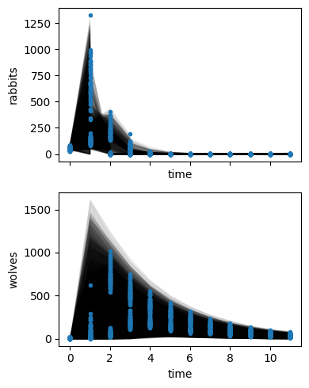

# Hierarchical Predator Prey modelling

The Lotka-Volterra predator-prey model is the archetypical model for dynamical systems, depicting the fluctuating population development of the dynamical system. 
It is simple enough to fit parameters and estimate their uncertainty in a single replicate. But what if there was some environmental fluctuation we wanted 


```python
import numpy as np
import arviz as az
import xarray as xr
import matplotlib.pyplot as plt
import preliz as pz

import jax
jax.config.update("jax_enable_x64", True)

from pymob import Config
from pymob.inference.scipy_backend import ScipyBackend
from pymob.sim.parameters import Param, RandomVariable
from pymob.sim.config import Modelparameters
from pymob.solvers.diffrax import JaxSolver
from pymob.inference.analysis import plot_pair
```

    WARNING (pytensor.tensor.blas): Using NumPy C-API based implementation for BLAS functions.


```python
# import case study and simulation

config = Config("../scenarios/lotka_volterra_hierarchical_hyperpriors/settings.cfg")
config.case_study.package = "../.."
config.case_study.scenario = "lotka_volterra_hierarchical_vaying_y0"

config.import_casestudy_modules(reset_path=True)
from sim import HierarchicalSimulation

sim = HierarchicalSimulation(config)
sim.setup()
```

    Inserted './../..' in PATH at index=0
    Inserted './../../lotka_volterra_case_study' in PATH at index=0
    MinMaxScaler(variable=rabbits, min=0.0, max=1329.0)
    MinMaxScaler(variable=wolves, min=0.0, max=1019.0)
    Results directory exists at '/home/flo-schu/projects/pymob/case_studies/lotka_volterra_case_study/results/lotka_volterra_hierarchical_vaying_y0'.
    Scenario directory exists at '/home/flo-schu/projects/pymob/case_studies/lotka_volterra_case_study/scenarios/lotka_volterra_hierarchical_vaying_y0'.


## Investigate the structure of $y_0$

For simulating our artificial data (`hierarchical_model.ipynb`), we assumed some initial values of $y_0$. The $y_0$ values were generated from a uniform distribution between 2 and 15 for wolves and a uniform distribution between 35 and 70. Then, after simulating the observations, a poisson noise model was added on top of the deterministic simulation.

So far, we have assumed that the noisy observation at $t=0$ are the true initial values for the simulation.

To demonstrate this effect. We look at two trajectories that have different starting values


```python
# expand time coordinates and constrain index coordinates for demonstration purposes
sim.coordinates["time"] = np.linspace(0,10,100)
# sim.coordinates["id"] = np.arange(0, 3)

sim.dispatch_constructor()
# TODO: Only partially replace the y0 values (like in theta)
e = sim.dispatch(
    theta={"alpha": 1, "beta": 0.02}, 
    y0={"rabbits": [50], "wolves":np.arange(1,121)}
)
e()

fig, (ax1, ax2) = plt.subplots(2,1)
for i in sim.coordinates["id"]:
    e.results.sel(id=i).wolves.plot(ax=ax1, label=f"id={i}")
    e.results.sel(id=i).rabbits.plot(ax=ax2, label=f"id={i}")

# plt.legend()

e.results
```


<div><svg style="position: absolute; width: 0; height: 0; overflow: hidden">
<defs>
<symbol id="icon-database" viewBox="0 0 32 32">
<path d="M16 0c-8.837 0-16 2.239-16 5v4c0 2.761 7.163 5 16 5s16-2.239 16-5v-4c0-2.761-7.163-5-16-5z"></path>
<path d="M16 17c-8.837 0-16-2.239-16-5v6c0 2.761 7.163 5 16 5s16-2.239 16-5v-6c0 2.761-7.163 5-16 5z"></path>
<path d="M16 26c-8.837 0-16-2.239-16-5v6c0 2.761 7.163 5 16 5s16-2.239 16-5v-6c0 2.761-7.163 5-16 5z"></path>
</symbol>
<symbol id="icon-file-text2" viewBox="0 0 32 32">
<path d="M28.681 7.159c-0.694-0.947-1.662-2.053-2.724-3.116s-2.169-2.030-3.116-2.724c-1.612-1.182-2.393-1.319-2.841-1.319h-15.5c-1.378 0-2.5 1.121-2.5 2.5v27c0 1.378 1.122 2.5 2.5 2.5h23c1.378 0 2.5-1.122 2.5-2.5v-19.5c0-0.448-0.137-1.23-1.319-2.841zM24.543 5.457c0.959 0.959 1.712 1.825 2.268 2.543h-4.811v-4.811c0.718 0.556 1.584 1.309 2.543 2.268zM28 29.5c0 0.271-0.229 0.5-0.5 0.5h-23c-0.271 0-0.5-0.229-0.5-0.5v-27c0-0.271 0.229-0.5 0.5-0.5 0 0 15.499-0 15.5 0v7c0 0.552 0.448 1 1 1h7v19.5z"></path>
<path d="M23 26h-14c-0.552 0-1-0.448-1-1s0.448-1 1-1h14c0.552 0 1 0.448 1 1s-0.448 1-1 1z"></path>
<path d="M23 22h-14c-0.552 0-1-0.448-1-1s0.448-1 1-1h14c0.552 0 1 0.448 1 1s-0.448 1-1 1z"></path>
<path d="M23 18h-14c-0.552 0-1-0.448-1-1s0.448-1 1-1h14c0.552 0 1 0.448 1 1s-0.448 1-1 1z"></path>
</symbol>
</defs>
</svg>
<style>/* CSS stylesheet for displaying xarray objects in jupyterlab.
 *
 */

:root {
  --xr-font-color0: var(--jp-content-font-color0, rgba(0, 0, 0, 1));
  --xr-font-color2: var(--jp-content-font-color2, rgba(0, 0, 0, 0.54));
  --xr-font-color3: var(--jp-content-font-color3, rgba(0, 0, 0, 0.38));
  --xr-border-color: var(--jp-border-color2, #e0e0e0);
  --xr-disabled-color: var(--jp-layout-color3, #bdbdbd);
  --xr-background-color: var(--jp-layout-color0, white);
  --xr-background-color-row-even: var(--jp-layout-color1, white);
  --xr-background-color-row-odd: var(--jp-layout-color2, #eeeeee);
}

html[theme=dark],
body[data-theme=dark],
body.vscode-dark {
  --xr-font-color0: rgba(255, 255, 255, 1);
  --xr-font-color2: rgba(255, 255, 255, 0.54);
  --xr-font-color3: rgba(255, 255, 255, 0.38);
  --xr-border-color: #1F1F1F;
  --xr-disabled-color: #515151;
  --xr-background-color: #111111;
  --xr-background-color-row-even: #111111;
  --xr-background-color-row-odd: #313131;
}

.xr-wrap {
  display: block !important;
  min-width: 300px;
  max-width: 700px;
}

.xr-text-repr-fallback {
  /* fallback to plain text repr when CSS is not injected (untrusted notebook) */
  display: none;
}

.xr-header {
  padding-top: 6px;
  padding-bottom: 6px;
  margin-bottom: 4px;
  border-bottom: solid 1px var(--xr-border-color);
}

.xr-header > div,
.xr-header > ul {
  display: inline;
  margin-top: 0;
  margin-bottom: 0;
}

.xr-obj-type,
.xr-array-name {
  margin-left: 2px;
  margin-right: 10px;
}

.xr-obj-type {
  color: var(--xr-font-color2);
}

.xr-sections {
  padding-left: 0 !important;
  display: grid;
  grid-template-columns: 150px auto auto 1fr 20px 20px;
}

.xr-section-item {
  display: contents;
}

.xr-section-item input {
  display: none;
}

.xr-section-item input + label {
  color: var(--xr-disabled-color);
}

.xr-section-item input:enabled + label {
  cursor: pointer;
  color: var(--xr-font-color2);
}

.xr-section-item input:enabled + label:hover {
  color: var(--xr-font-color0);
}

.xr-section-summary {
  grid-column: 1;
  color: var(--xr-font-color2);
  font-weight: 500;
}

.xr-section-summary > span {
  display: inline-block;
  padding-left: 0.5em;
}

.xr-section-summary-in:disabled + label {
  color: var(--xr-font-color2);
}

.xr-section-summary-in + label:before {
  display: inline-block;
  content: '►';
  font-size: 11px;
  width: 15px;
  text-align: center;
}

.xr-section-summary-in:disabled + label:before {
  color: var(--xr-disabled-color);
}

.xr-section-summary-in:checked + label:before {
  content: '▼';
}

.xr-section-summary-in:checked + label > span {
  display: none;
}

.xr-section-summary,
.xr-section-inline-details {
  padding-top: 4px;
  padding-bottom: 4px;
}

.xr-section-inline-details {
  grid-column: 2 / -1;
}

.xr-section-details {
  display: none;
  grid-column: 1 / -1;
  margin-bottom: 5px;
}

.xr-section-summary-in:checked ~ .xr-section-details {
  display: contents;
}

.xr-array-wrap {
  grid-column: 1 / -1;
  display: grid;
  grid-template-columns: 20px auto;
}

.xr-array-wrap > label {
  grid-column: 1;
  vertical-align: top;
}

.xr-preview {
  color: var(--xr-font-color3);
}

.xr-array-preview,
.xr-array-data {
  padding: 0 5px !important;
  grid-column: 2;
}

.xr-array-data,
.xr-array-in:checked ~ .xr-array-preview {
  display: none;
}

.xr-array-in:checked ~ .xr-array-data,
.xr-array-preview {
  display: inline-block;
}

.xr-dim-list {
  display: inline-block !important;
  list-style: none;
  padding: 0 !important;
  margin: 0;
}

.xr-dim-list li {
  display: inline-block;
  padding: 0;
  margin: 0;
}

.xr-dim-list:before {
  content: '(';
}

.xr-dim-list:after {
  content: ')';
}

.xr-dim-list li:not(:last-child):after {
  content: ',';
  padding-right: 5px;
}

.xr-has-index {
  font-weight: bold;
}

.xr-var-list,
.xr-var-item {
  display: contents;
}

.xr-var-item > div,
.xr-var-item label,
.xr-var-item > .xr-var-name span {
  background-color: var(--xr-background-color-row-even);
  margin-bottom: 0;
}

.xr-var-item > .xr-var-name:hover span {
  padding-right: 5px;
}

.xr-var-list > li:nth-child(odd) > div,
.xr-var-list > li:nth-child(odd) > label,
.xr-var-list > li:nth-child(odd) > .xr-var-name span {
  background-color: var(--xr-background-color-row-odd);
}

.xr-var-name {
  grid-column: 1;
}

.xr-var-dims {
  grid-column: 2;
}

.xr-var-dtype {
  grid-column: 3;
  text-align: right;
  color: var(--xr-font-color2);
}

.xr-var-preview {
  grid-column: 4;
}

.xr-index-preview {
  grid-column: 2 / 5;
  color: var(--xr-font-color2);
}

.xr-var-name,
.xr-var-dims,
.xr-var-dtype,
.xr-preview,
.xr-attrs dt {
  white-space: nowrap;
  overflow: hidden;
  text-overflow: ellipsis;
  padding-right: 10px;
}

.xr-var-name:hover,
.xr-var-dims:hover,
.xr-var-dtype:hover,
.xr-attrs dt:hover {
  overflow: visible;
  width: auto;
  z-index: 1;
}

.xr-var-attrs,
.xr-var-data,
.xr-index-data {
  display: none;
  background-color: var(--xr-background-color) !important;
  padding-bottom: 5px !important;
}

.xr-var-attrs-in:checked ~ .xr-var-attrs,
.xr-var-data-in:checked ~ .xr-var-data,
.xr-index-data-in:checked ~ .xr-index-data {
  display: block;
}

.xr-var-data > table {
  float: right;
}

.xr-var-name span,
.xr-var-data,
.xr-index-name div,
.xr-index-data,
.xr-attrs {
  padding-left: 25px !important;
}

.xr-attrs,
.xr-var-attrs,
.xr-var-data,
.xr-index-data {
  grid-column: 1 / -1;
}

dl.xr-attrs {
  padding: 0;
  margin: 0;
  display: grid;
  grid-template-columns: 125px auto;
}

.xr-attrs dt,
.xr-attrs dd {
  padding: 0;
  margin: 0;
  float: left;
  padding-right: 10px;
  width: auto;
}

.xr-attrs dt {
  font-weight: normal;
  grid-column: 1;
}

.xr-attrs dt:hover span {
  display: inline-block;
  background: var(--xr-background-color);
  padding-right: 10px;
}

.xr-attrs dd {
  grid-column: 2;
  white-space: pre-wrap;
  word-break: break-all;
}

.xr-icon-database,
.xr-icon-file-text2,
.xr-no-icon {
  display: inline-block;
  vertical-align: middle;
  width: 1em;
  height: 1.5em !important;
  stroke-width: 0;
  stroke: currentColor;
  fill: currentColor;
}
</style><pre class='xr-text-repr-fallback'>&lt;xarray.Dataset&gt;
Dimensions:               (id: 120, time: 100)
Coordinates:
  * id                    (id) int32 0 1 2 3 4 5 6 ... 114 115 116 117 118 119
  * time                  (time) float64 0.0 0.101 0.202 ... 9.798 9.899 10.0
    rabbit_species        (id) object &#x27;Cottontail&#x27; &#x27;Cottontail&#x27; ... &#x27;Jackrabbit&#x27;
    experiment            (id) object &#x27;2010&#x27; &#x27;2010&#x27; &#x27;2010&#x27; ... &#x27;2012&#x27; &#x27;2012&#x27;
    rabbit_species_index  (id) int64 0 0 0 0 0 0 0 0 0 0 ... 1 1 1 1 1 1 1 1 1 1
    experiment_index      (id) int64 0 0 0 0 0 0 0 0 0 0 ... 2 2 2 2 2 2 2 2 2 2
Data variables:
    rabbits               (id, time) float64 50.0 55.2 60.94 ... 27.61 29.72
    wolves                (id, time) float64 1.0 1.023 1.052 ... 13.67 13.65</pre><div class='xr-wrap' style='display:none'><div class='xr-header'><div class='xr-obj-type'>xarray.Dataset</div></div><ul class='xr-sections'><li class='xr-section-item'><input id='section-a91e4814-1114-4c5a-996a-bbb5e4544318' class='xr-section-summary-in' type='checkbox' disabled ><label for='section-a91e4814-1114-4c5a-996a-bbb5e4544318' class='xr-section-summary'  title='Expand/collapse section'>Dimensions:</label><div class='xr-section-inline-details'><ul class='xr-dim-list'><li><span class='xr-has-index'>id</span>: 120</li><li><span class='xr-has-index'>time</span>: 100</li></ul></div><div class='xr-section-details'></div></li><li class='xr-section-item'><input id='section-0fe8ea69-80bd-4b0f-84fd-19821302daab' class='xr-section-summary-in' type='checkbox'  checked><label for='section-0fe8ea69-80bd-4b0f-84fd-19821302daab' class='xr-section-summary' >Coordinates: <span>(6)</span></label><div class='xr-section-inline-details'></div><div class='xr-section-details'><ul class='xr-var-list'><li class='xr-var-item'><div class='xr-var-name'><span class='xr-has-index'>id</span></div><div class='xr-var-dims'>(id)</div><div class='xr-var-dtype'>int32</div><div class='xr-var-preview xr-preview'>0 1 2 3 4 5 ... 115 116 117 118 119</div><input id='attrs-5d1f7000-5078-4013-9065-09b0146c7017' class='xr-var-attrs-in' type='checkbox' disabled><label for='attrs-5d1f7000-5078-4013-9065-09b0146c7017' title='Show/Hide attributes'><svg class='icon xr-icon-file-text2'><use xlink:href='#icon-file-text2'></use></svg></label><input id='data-5f032db0-8c62-4479-8684-0f5f84a1266b' class='xr-var-data-in' type='checkbox'><label for='data-5f032db0-8c62-4479-8684-0f5f84a1266b' title='Show/Hide data repr'><svg class='icon xr-icon-database'><use xlink:href='#icon-database'></use></svg></label><div class='xr-var-attrs'><dl class='xr-attrs'></dl></div><div class='xr-var-data'><pre>array([  0,   1,   2,   3,   4,   5,   6,   7,   8,   9,  10,  11,  12,  13,
        14,  15,  16,  17,  18,  19,  20,  21,  22,  23,  24,  25,  26,  27,
        28,  29,  30,  31,  32,  33,  34,  35,  36,  37,  38,  39,  40,  41,
        42,  43,  44,  45,  46,  47,  48,  49,  50,  51,  52,  53,  54,  55,
        56,  57,  58,  59,  60,  61,  62,  63,  64,  65,  66,  67,  68,  69,
        70,  71,  72,  73,  74,  75,  76,  77,  78,  79,  80,  81,  82,  83,
        84,  85,  86,  87,  88,  89,  90,  91,  92,  93,  94,  95,  96,  97,
        98,  99, 100, 101, 102, 103, 104, 105, 106, 107, 108, 109, 110, 111,
       112, 113, 114, 115, 116, 117, 118, 119], dtype=int32)</pre></div></li><li class='xr-var-item'><div class='xr-var-name'><span class='xr-has-index'>time</span></div><div class='xr-var-dims'>(time)</div><div class='xr-var-dtype'>float64</div><div class='xr-var-preview xr-preview'>0.0 0.101 0.202 ... 9.899 10.0</div><input id='attrs-dabfa155-6d18-4dad-bfc0-52c19f1bf53c' class='xr-var-attrs-in' type='checkbox' disabled><label for='attrs-dabfa155-6d18-4dad-bfc0-52c19f1bf53c' title='Show/Hide attributes'><svg class='icon xr-icon-file-text2'><use xlink:href='#icon-file-text2'></use></svg></label><input id='data-587a023f-2e77-4213-b93c-74ebc51015e6' class='xr-var-data-in' type='checkbox'><label for='data-587a023f-2e77-4213-b93c-74ebc51015e6' title='Show/Hide data repr'><svg class='icon xr-icon-database'><use xlink:href='#icon-database'></use></svg></label><div class='xr-var-attrs'><dl class='xr-attrs'></dl></div><div class='xr-var-data'><pre>array([ 0.      ,  0.10101 ,  0.20202 ,  0.30303 ,  0.40404 ,  0.505051,
        0.606061,  0.707071,  0.808081,  0.909091,  1.010101,  1.111111,
        1.212121,  1.313131,  1.414141,  1.515152,  1.616162,  1.717172,
        1.818182,  1.919192,  2.020202,  2.121212,  2.222222,  2.323232,
        2.424242,  2.525253,  2.626263,  2.727273,  2.828283,  2.929293,
        3.030303,  3.131313,  3.232323,  3.333333,  3.434343,  3.535354,
        3.636364,  3.737374,  3.838384,  3.939394,  4.040404,  4.141414,
        4.242424,  4.343434,  4.444444,  4.545455,  4.646465,  4.747475,
        4.848485,  4.949495,  5.050505,  5.151515,  5.252525,  5.353535,
        5.454545,  5.555556,  5.656566,  5.757576,  5.858586,  5.959596,
        6.060606,  6.161616,  6.262626,  6.363636,  6.464646,  6.565657,
        6.666667,  6.767677,  6.868687,  6.969697,  7.070707,  7.171717,
        7.272727,  7.373737,  7.474747,  7.575758,  7.676768,  7.777778,
        7.878788,  7.979798,  8.080808,  8.181818,  8.282828,  8.383838,
        8.484848,  8.585859,  8.686869,  8.787879,  8.888889,  8.989899,
        9.090909,  9.191919,  9.292929,  9.393939,  9.494949,  9.59596 ,
        9.69697 ,  9.79798 ,  9.89899 , 10.      ])</pre></div></li><li class='xr-var-item'><div class='xr-var-name'><span>rabbit_species</span></div><div class='xr-var-dims'>(id)</div><div class='xr-var-dtype'>object</div><div class='xr-var-preview xr-preview'>&#x27;Cottontail&#x27; ... &#x27;Jackrabbit&#x27;</div><input id='attrs-88564a3e-aa5b-45cd-ac5b-d85988aa818f' class='xr-var-attrs-in' type='checkbox' disabled><label for='attrs-88564a3e-aa5b-45cd-ac5b-d85988aa818f' title='Show/Hide attributes'><svg class='icon xr-icon-file-text2'><use xlink:href='#icon-file-text2'></use></svg></label><input id='data-999e1737-e6ac-4712-b6a8-569267a60302' class='xr-var-data-in' type='checkbox'><label for='data-999e1737-e6ac-4712-b6a8-569267a60302' title='Show/Hide data repr'><svg class='icon xr-icon-database'><use xlink:href='#icon-database'></use></svg></label><div class='xr-var-attrs'><dl class='xr-attrs'></dl></div><div class='xr-var-data'><pre>array([&#x27;Cottontail&#x27;, &#x27;Cottontail&#x27;, &#x27;Cottontail&#x27;, &#x27;Cottontail&#x27;,
       &#x27;Cottontail&#x27;, &#x27;Cottontail&#x27;, &#x27;Cottontail&#x27;, &#x27;Cottontail&#x27;,
       &#x27;Cottontail&#x27;, &#x27;Cottontail&#x27;, &#x27;Cottontail&#x27;, &#x27;Cottontail&#x27;,
       &#x27;Cottontail&#x27;, &#x27;Cottontail&#x27;, &#x27;Cottontail&#x27;, &#x27;Cottontail&#x27;,
       &#x27;Cottontail&#x27;, &#x27;Cottontail&#x27;, &#x27;Cottontail&#x27;, &#x27;Cottontail&#x27;,
       &#x27;Jackrabbit&#x27;, &#x27;Jackrabbit&#x27;, &#x27;Jackrabbit&#x27;, &#x27;Jackrabbit&#x27;,
       &#x27;Jackrabbit&#x27;, &#x27;Jackrabbit&#x27;, &#x27;Jackrabbit&#x27;, &#x27;Jackrabbit&#x27;,
       &#x27;Jackrabbit&#x27;, &#x27;Jackrabbit&#x27;, &#x27;Jackrabbit&#x27;, &#x27;Jackrabbit&#x27;,
       &#x27;Jackrabbit&#x27;, &#x27;Jackrabbit&#x27;, &#x27;Jackrabbit&#x27;, &#x27;Jackrabbit&#x27;,
       &#x27;Jackrabbit&#x27;, &#x27;Jackrabbit&#x27;, &#x27;Jackrabbit&#x27;, &#x27;Jackrabbit&#x27;,
       &#x27;Cottontail&#x27;, &#x27;Cottontail&#x27;, &#x27;Cottontail&#x27;, &#x27;Cottontail&#x27;,
       &#x27;Cottontail&#x27;, &#x27;Cottontail&#x27;, &#x27;Cottontail&#x27;, &#x27;Cottontail&#x27;,
       &#x27;Cottontail&#x27;, &#x27;Cottontail&#x27;, &#x27;Cottontail&#x27;, &#x27;Cottontail&#x27;,
       &#x27;Cottontail&#x27;, &#x27;Cottontail&#x27;, &#x27;Cottontail&#x27;, &#x27;Cottontail&#x27;,
       &#x27;Cottontail&#x27;, &#x27;Cottontail&#x27;, &#x27;Cottontail&#x27;, &#x27;Cottontail&#x27;,
       &#x27;Jackrabbit&#x27;, &#x27;Jackrabbit&#x27;, &#x27;Jackrabbit&#x27;, &#x27;Jackrabbit&#x27;,
       &#x27;Jackrabbit&#x27;, &#x27;Jackrabbit&#x27;, &#x27;Jackrabbit&#x27;, &#x27;Jackrabbit&#x27;,
       &#x27;Jackrabbit&#x27;, &#x27;Jackrabbit&#x27;, &#x27;Jackrabbit&#x27;, &#x27;Jackrabbit&#x27;,
       &#x27;Jackrabbit&#x27;, &#x27;Jackrabbit&#x27;, &#x27;Jackrabbit&#x27;, &#x27;Jackrabbit&#x27;,
       &#x27;Jackrabbit&#x27;, &#x27;Jackrabbit&#x27;, &#x27;Jackrabbit&#x27;, &#x27;Jackrabbit&#x27;,
       &#x27;Cottontail&#x27;, &#x27;Cottontail&#x27;, &#x27;Cottontail&#x27;, &#x27;Cottontail&#x27;,
       &#x27;Cottontail&#x27;, &#x27;Cottontail&#x27;, &#x27;Cottontail&#x27;, &#x27;Cottontail&#x27;,
       &#x27;Cottontail&#x27;, &#x27;Cottontail&#x27;, &#x27;Cottontail&#x27;, &#x27;Cottontail&#x27;,
       &#x27;Cottontail&#x27;, &#x27;Cottontail&#x27;, &#x27;Cottontail&#x27;, &#x27;Cottontail&#x27;,
       &#x27;Cottontail&#x27;, &#x27;Cottontail&#x27;, &#x27;Cottontail&#x27;, &#x27;Cottontail&#x27;,
       &#x27;Jackrabbit&#x27;, &#x27;Jackrabbit&#x27;, &#x27;Jackrabbit&#x27;, &#x27;Jackrabbit&#x27;,
       &#x27;Jackrabbit&#x27;, &#x27;Jackrabbit&#x27;, &#x27;Jackrabbit&#x27;, &#x27;Jackrabbit&#x27;,
       &#x27;Jackrabbit&#x27;, &#x27;Jackrabbit&#x27;, &#x27;Jackrabbit&#x27;, &#x27;Jackrabbit&#x27;,
       &#x27;Jackrabbit&#x27;, &#x27;Jackrabbit&#x27;, &#x27;Jackrabbit&#x27;, &#x27;Jackrabbit&#x27;,
       &#x27;Jackrabbit&#x27;, &#x27;Jackrabbit&#x27;, &#x27;Jackrabbit&#x27;, &#x27;Jackrabbit&#x27;],
      dtype=object)</pre></div></li><li class='xr-var-item'><div class='xr-var-name'><span>experiment</span></div><div class='xr-var-dims'>(id)</div><div class='xr-var-dtype'>object</div><div class='xr-var-preview xr-preview'>&#x27;2010&#x27; &#x27;2010&#x27; ... &#x27;2012&#x27; &#x27;2012&#x27;</div><input id='attrs-bbae3408-e84f-4ef2-aae6-9f272c33f4c5' class='xr-var-attrs-in' type='checkbox' disabled><label for='attrs-bbae3408-e84f-4ef2-aae6-9f272c33f4c5' title='Show/Hide attributes'><svg class='icon xr-icon-file-text2'><use xlink:href='#icon-file-text2'></use></svg></label><input id='data-e7b0e779-90d0-4e50-a205-7c1cbe1216d7' class='xr-var-data-in' type='checkbox'><label for='data-e7b0e779-90d0-4e50-a205-7c1cbe1216d7' title='Show/Hide data repr'><svg class='icon xr-icon-database'><use xlink:href='#icon-database'></use></svg></label><div class='xr-var-attrs'><dl class='xr-attrs'></dl></div><div class='xr-var-data'><pre>array([&#x27;2010&#x27;, &#x27;2010&#x27;, &#x27;2010&#x27;, &#x27;2010&#x27;, &#x27;2010&#x27;, &#x27;2010&#x27;, &#x27;2010&#x27;, &#x27;2010&#x27;,
       &#x27;2010&#x27;, &#x27;2010&#x27;, &#x27;2010&#x27;, &#x27;2010&#x27;, &#x27;2010&#x27;, &#x27;2010&#x27;, &#x27;2010&#x27;, &#x27;2010&#x27;,
       &#x27;2010&#x27;, &#x27;2010&#x27;, &#x27;2010&#x27;, &#x27;2010&#x27;, &#x27;2010&#x27;, &#x27;2010&#x27;, &#x27;2010&#x27;, &#x27;2010&#x27;,
       &#x27;2010&#x27;, &#x27;2010&#x27;, &#x27;2010&#x27;, &#x27;2010&#x27;, &#x27;2010&#x27;, &#x27;2010&#x27;, &#x27;2010&#x27;, &#x27;2010&#x27;,
       &#x27;2010&#x27;, &#x27;2010&#x27;, &#x27;2010&#x27;, &#x27;2010&#x27;, &#x27;2010&#x27;, &#x27;2010&#x27;, &#x27;2010&#x27;, &#x27;2010&#x27;,
       &#x27;2011&#x27;, &#x27;2011&#x27;, &#x27;2011&#x27;, &#x27;2011&#x27;, &#x27;2011&#x27;, &#x27;2011&#x27;, &#x27;2011&#x27;, &#x27;2011&#x27;,
       &#x27;2011&#x27;, &#x27;2011&#x27;, &#x27;2011&#x27;, &#x27;2011&#x27;, &#x27;2011&#x27;, &#x27;2011&#x27;, &#x27;2011&#x27;, &#x27;2011&#x27;,
       &#x27;2011&#x27;, &#x27;2011&#x27;, &#x27;2011&#x27;, &#x27;2011&#x27;, &#x27;2011&#x27;, &#x27;2011&#x27;, &#x27;2011&#x27;, &#x27;2011&#x27;,
       &#x27;2011&#x27;, &#x27;2011&#x27;, &#x27;2011&#x27;, &#x27;2011&#x27;, &#x27;2011&#x27;, &#x27;2011&#x27;, &#x27;2011&#x27;, &#x27;2011&#x27;,
       &#x27;2011&#x27;, &#x27;2011&#x27;, &#x27;2011&#x27;, &#x27;2011&#x27;, &#x27;2011&#x27;, &#x27;2011&#x27;, &#x27;2011&#x27;, &#x27;2011&#x27;,
       &#x27;2012&#x27;, &#x27;2012&#x27;, &#x27;2012&#x27;, &#x27;2012&#x27;, &#x27;2012&#x27;, &#x27;2012&#x27;, &#x27;2012&#x27;, &#x27;2012&#x27;,
       &#x27;2012&#x27;, &#x27;2012&#x27;, &#x27;2012&#x27;, &#x27;2012&#x27;, &#x27;2012&#x27;, &#x27;2012&#x27;, &#x27;2012&#x27;, &#x27;2012&#x27;,
       &#x27;2012&#x27;, &#x27;2012&#x27;, &#x27;2012&#x27;, &#x27;2012&#x27;, &#x27;2012&#x27;, &#x27;2012&#x27;, &#x27;2012&#x27;, &#x27;2012&#x27;,
       &#x27;2012&#x27;, &#x27;2012&#x27;, &#x27;2012&#x27;, &#x27;2012&#x27;, &#x27;2012&#x27;, &#x27;2012&#x27;, &#x27;2012&#x27;, &#x27;2012&#x27;,
       &#x27;2012&#x27;, &#x27;2012&#x27;, &#x27;2012&#x27;, &#x27;2012&#x27;, &#x27;2012&#x27;, &#x27;2012&#x27;, &#x27;2012&#x27;, &#x27;2012&#x27;],
      dtype=object)</pre></div></li><li class='xr-var-item'><div class='xr-var-name'><span>rabbit_species_index</span></div><div class='xr-var-dims'>(id)</div><div class='xr-var-dtype'>int64</div><div class='xr-var-preview xr-preview'>0 0 0 0 0 0 0 0 ... 1 1 1 1 1 1 1 1</div><input id='attrs-706f7e32-6fae-41b7-b56f-fd46f88e0c1d' class='xr-var-attrs-in' type='checkbox' disabled><label for='attrs-706f7e32-6fae-41b7-b56f-fd46f88e0c1d' title='Show/Hide attributes'><svg class='icon xr-icon-file-text2'><use xlink:href='#icon-file-text2'></use></svg></label><input id='data-77e35ee3-3aa5-4db1-9c3d-cb3e4ba07596' class='xr-var-data-in' type='checkbox'><label for='data-77e35ee3-3aa5-4db1-9c3d-cb3e4ba07596' title='Show/Hide data repr'><svg class='icon xr-icon-database'><use xlink:href='#icon-database'></use></svg></label><div class='xr-var-attrs'><dl class='xr-attrs'></dl></div><div class='xr-var-data'><pre>array([0, 0, 0, 0, 0, 0, 0, 0, 0, 0, 0, 0, 0, 0, 0, 0, 0, 0, 0, 0, 1, 1,
       1, 1, 1, 1, 1, 1, 1, 1, 1, 1, 1, 1, 1, 1, 1, 1, 1, 1, 0, 0, 0, 0,
       0, 0, 0, 0, 0, 0, 0, 0, 0, 0, 0, 0, 0, 0, 0, 0, 1, 1, 1, 1, 1, 1,
       1, 1, 1, 1, 1, 1, 1, 1, 1, 1, 1, 1, 1, 1, 0, 0, 0, 0, 0, 0, 0, 0,
       0, 0, 0, 0, 0, 0, 0, 0, 0, 0, 0, 0, 1, 1, 1, 1, 1, 1, 1, 1, 1, 1,
       1, 1, 1, 1, 1, 1, 1, 1, 1, 1])</pre></div></li><li class='xr-var-item'><div class='xr-var-name'><span>experiment_index</span></div><div class='xr-var-dims'>(id)</div><div class='xr-var-dtype'>int64</div><div class='xr-var-preview xr-preview'>0 0 0 0 0 0 0 0 ... 2 2 2 2 2 2 2 2</div><input id='attrs-82f61ed9-178a-40e7-aae6-4665466b6c9a' class='xr-var-attrs-in' type='checkbox' disabled><label for='attrs-82f61ed9-178a-40e7-aae6-4665466b6c9a' title='Show/Hide attributes'><svg class='icon xr-icon-file-text2'><use xlink:href='#icon-file-text2'></use></svg></label><input id='data-8ac62f41-e164-4618-b772-96538332b090' class='xr-var-data-in' type='checkbox'><label for='data-8ac62f41-e164-4618-b772-96538332b090' title='Show/Hide data repr'><svg class='icon xr-icon-database'><use xlink:href='#icon-database'></use></svg></label><div class='xr-var-attrs'><dl class='xr-attrs'></dl></div><div class='xr-var-data'><pre>array([0, 0, 0, 0, 0, 0, 0, 0, 0, 0, 0, 0, 0, 0, 0, 0, 0, 0, 0, 0, 0, 0,
       0, 0, 0, 0, 0, 0, 0, 0, 0, 0, 0, 0, 0, 0, 0, 0, 0, 0, 1, 1, 1, 1,
       1, 1, 1, 1, 1, 1, 1, 1, 1, 1, 1, 1, 1, 1, 1, 1, 1, 1, 1, 1, 1, 1,
       1, 1, 1, 1, 1, 1, 1, 1, 1, 1, 1, 1, 1, 1, 2, 2, 2, 2, 2, 2, 2, 2,
       2, 2, 2, 2, 2, 2, 2, 2, 2, 2, 2, 2, 2, 2, 2, 2, 2, 2, 2, 2, 2, 2,
       2, 2, 2, 2, 2, 2, 2, 2, 2, 2])</pre></div></li></ul></div></li><li class='xr-section-item'><input id='section-a435a06b-0160-4e91-8165-569f6cabdc83' class='xr-section-summary-in' type='checkbox'  checked><label for='section-a435a06b-0160-4e91-8165-569f6cabdc83' class='xr-section-summary' >Data variables: <span>(2)</span></label><div class='xr-section-inline-details'></div><div class='xr-section-details'><ul class='xr-var-list'><li class='xr-var-item'><div class='xr-var-name'><span>rabbits</span></div><div class='xr-var-dims'>(id, time)</div><div class='xr-var-dtype'>float64</div><div class='xr-var-preview xr-preview'>50.0 55.2 60.94 ... 27.61 29.72</div><input id='attrs-ad65f473-0c66-4106-a795-ab934b1709cb' class='xr-var-attrs-in' type='checkbox' disabled><label for='attrs-ad65f473-0c66-4106-a795-ab934b1709cb' title='Show/Hide attributes'><svg class='icon xr-icon-file-text2'><use xlink:href='#icon-file-text2'></use></svg></label><input id='data-f0dbaf9d-4a44-4ca5-a6e2-a5a91bcdb192' class='xr-var-data-in' type='checkbox'><label for='data-f0dbaf9d-4a44-4ca5-a6e2-a5a91bcdb192' title='Show/Hide data repr'><svg class='icon xr-icon-database'><use xlink:href='#icon-database'></use></svg></label><div class='xr-var-attrs'><dl class='xr-attrs'></dl></div><div class='xr-var-data'><pre>array([[5.00000000e+01, 5.52015265e+01, 6.09409699e+01, ...,
        5.51465663e-04, 5.58778947e-04, 5.67675464e-04],
       [5.00000000e+01, 5.50888965e+01, 6.06893637e+01, ...,
        5.65661165e-03, 5.79891760e-03, 5.95832344e-03],
       [5.00000000e+01, 5.49765004e+01, 6.04388336e+01, ...,
        2.21514628e-02, 2.28569169e-02, 2.36338931e-02],
       ...,
       [5.00000000e+01, 4.34885376e+01, 3.77002357e+01, ...,
        2.77877074e+01, 2.98778229e+01, 3.21252558e+01],
       [5.00000000e+01, 4.34001476e+01, 3.75469313e+01, ...,
        2.67114510e+01, 2.87328854e+01, 3.09083931e+01],
       [5.00000000e+01, 4.33119399e+01, 3.73942758e+01, ...,
        2.56595255e+01, 2.76125042e+01, 2.97160895e+01]])</pre></div></li><li class='xr-var-item'><div class='xr-var-name'><span>wolves</span></div><div class='xr-var-dims'>(id, time)</div><div class='xr-var-dtype'>float64</div><div class='xr-var-preview xr-preview'>1.0 1.023 1.052 ... 13.67 13.65</div><input id='attrs-fc0f134d-af09-4f1b-bdd1-4d2c6154ef52' class='xr-var-attrs-in' type='checkbox' disabled><label for='attrs-fc0f134d-af09-4f1b-bdd1-4d2c6154ef52' title='Show/Hide attributes'><svg class='icon xr-icon-file-text2'><use xlink:href='#icon-file-text2'></use></svg></label><input id='data-b47d7cbe-bb67-420d-a8d2-e1f9c095999b' class='xr-var-data-in' type='checkbox'><label for='data-b47d7cbe-bb67-420d-a8d2-e1f9c095999b' title='Show/Hide data repr'><svg class='icon xr-icon-database'><use xlink:href='#icon-database'></use></svg></label><div class='xr-var-attrs'><dl class='xr-attrs'></dl></div><div class='xr-var-data'><pre>array([[  1.        ,   1.02304752,   1.0524229 , ...,  44.1408377 ,
         42.82332444,  41.54513642],
       [  2.        ,   2.04598278,   2.10434859, ...,  38.27582588,
         37.13356826,  36.02540106],
       [  3.        ,   3.06880602,   3.15577945, ...,  35.00628505,
         33.96217205,  32.94922583],
       ...,
       [118.        , 120.0054908 , 121.28910486, ...,  14.11206534,
         14.09525724,  14.10933143],
       [119.        , 121.01683072, 122.2960945 , ...,  13.90821885,
         13.8760808 ,  13.87338134],
       [120.        , 122.02808356, 123.30279067, ...,  13.71552191,
         13.66882582,  13.65021799]])</pre></div></li></ul></div></li><li class='xr-section-item'><input id='section-eb57be23-9bb3-4a8f-a983-ea78cce1a303' class='xr-section-summary-in' type='checkbox'  ><label for='section-eb57be23-9bb3-4a8f-a983-ea78cce1a303' class='xr-section-summary' >Indexes: <span>(2)</span></label><div class='xr-section-inline-details'></div><div class='xr-section-details'><ul class='xr-var-list'><li class='xr-var-item'><div class='xr-index-name'><div>id</div></div><div class='xr-index-preview'>PandasIndex</div><div></div><input id='index-f900cdd1-39b2-4a6d-8866-93c0ee21c2a8' class='xr-index-data-in' type='checkbox'/><label for='index-f900cdd1-39b2-4a6d-8866-93c0ee21c2a8' title='Show/Hide index repr'><svg class='icon xr-icon-database'><use xlink:href='#icon-database'></use></svg></label><div class='xr-index-data'><pre>PandasIndex(Index([  0,   1,   2,   3,   4,   5,   6,   7,   8,   9,
       ...
       110, 111, 112, 113, 114, 115, 116, 117, 118, 119],
      dtype=&#x27;int32&#x27;, name=&#x27;id&#x27;, length=120))</pre></div></li><li class='xr-var-item'><div class='xr-index-name'><div>time</div></div><div class='xr-index-preview'>PandasIndex</div><div></div><input id='index-9e39f27a-a518-41c2-84ed-ec081230fb7a' class='xr-index-data-in' type='checkbox'/><label for='index-9e39f27a-a518-41c2-84ed-ec081230fb7a' title='Show/Hide index repr'><svg class='icon xr-icon-database'><use xlink:href='#icon-database'></use></svg></label><div class='xr-index-data'><pre>PandasIndex(Index([                0.0, 0.10101010101010101, 0.20202020202020202,
       0.30303030303030304, 0.40404040404040403,  0.5050505050505051,
        0.6060606060606061,  0.7070707070707071,  0.8080808080808081,
        0.9090909090909091,  1.0101010101010102,  1.1111111111111112,
        1.2121212121212122,  1.3131313131313131,  1.4141414141414141,
        1.5151515151515151,  1.6161616161616161,  1.7171717171717171,
        1.8181818181818181,  1.9191919191919191,  2.0202020202020203,
         2.121212121212121,  2.2222222222222223,   2.323232323232323,
        2.4242424242424243,   2.525252525252525,  2.6262626262626263,
         2.727272727272727,  2.8282828282828283,   2.929292929292929,
        3.0303030303030303,   3.131313131313131,  3.2323232323232323,
        3.3333333333333335,  3.4343434343434343,  3.5353535353535355,
        3.6363636363636362,  3.7373737373737375,  3.8383838383838382,
        3.9393939393939394,   4.040404040404041,   4.141414141414141,
         4.242424242424242,   4.343434343434343,   4.444444444444445,
         4.545454545454545,   4.646464646464646,   4.747474747474747,
         4.848484848484849,    4.94949494949495,    5.05050505050505,
         5.151515151515151,   5.252525252525253,   5.353535353535354,
         5.454545454545454,   5.555555555555555,   5.656565656565657,
         5.757575757575758,   5.858585858585858,   5.959595959595959,
        6.0606060606060606,   6.161616161616162,   6.262626262626262,
         6.363636363636363,  6.4646464646464645,   6.565656565656566,
         6.666666666666667,   6.767676767676767,  6.8686868686868685,
          6.96969696969697,   7.070707070707071,   7.171717171717171,
        7.2727272727272725,   7.373737373737374,   7.474747474747475,
         7.575757575757575,  7.6767676767676765,   7.777777777777778,
         7.878787878787879,   7.979797979797979,   8.080808080808081,
         8.181818181818182,   8.282828282828282,   8.383838383838384,
         8.484848484848484,   8.585858585858587,   8.686868686868687,
         8.787878787878787,    8.88888888888889,    8.98989898989899,
          9.09090909090909,   9.191919191919192,   9.292929292929292,
         9.393939393939394,   9.494949494949495,   9.595959595959595,
         9.696969696969697,   9.797979797979798,     9.8989898989899,
                      10.0],
      dtype=&#x27;float64&#x27;, name=&#x27;time&#x27;))</pre></div></li></ul></div></li><li class='xr-section-item'><input id='section-8e02d158-5074-4c6e-895c-1b540dddd275' class='xr-section-summary-in' type='checkbox' disabled ><label for='section-8e02d158-5074-4c6e-895c-1b540dddd275' class='xr-section-summary'  title='Expand/collapse section'>Attributes: <span>(0)</span></label><div class='xr-section-inline-details'></div><div class='xr-section-details'><dl class='xr-attrs'></dl></div></li></ul></div></div>


    

    


In this *mild* case, only the starting population of the rabbits vary (56, 44), while wolves are identical. Despite, we see quite some differences in the dynamic, although the model parameters are the same.

We need to esimtate the true $y_0$ values to remove this bias.

Assuming that $y_0$ is not known, means we also have to define a prior for the starting values and draw realizations of the starting population from a distribution.

This gives us two approaches:
1. We know nothing about the true initial population. This would result in a Uniform prior over the entire span of the data and then add some more, because the true value could lie above or below the range (in our case it will lie only above).
2. We know the observed $y_0$ value and use this as a mean for a prior distribution and assume the error of this prior is the same for each initial value accross all experiments. This can of course become arbitrarily complex, where we could assume that the error on the initial value is different from year to year or species to species, but saying the error on the prior distribution for y0 is always the same seems to be a good first approximation (and we know it's true.)

In order to not make our lives harder for an artificial problem, lets take a look at the distributions of the starting values.


```python
y0 = sim.parse_input("y0", reference_data=sim.observations, drop_dims=["time"])

unif_wolves = pz.Uniform()
pois_wolves = pz.Poisson()
lnorm_wolves = pz.LogNormal()
gamma_wolves = pz.Gamma()

_, ax = pz.mle([pois_wolves, unif_wolves, lnorm_wolves, gamma_wolves], y0["wolves"], plot=4)

unif_rabbits = pz.Uniform()
pois_rabbits = pz.Poisson()
lnorm_rabbits = pz.LogNormal()
gamma_rabbits = pz.Gamma()
_, ax = pz.mle([pois_rabbits, unif_rabbits, lnorm_wolves, gamma_rabbits], y0["rabbits"], plot=4)
```


    

    


## Fitting the initial values


```python
sim.config.jaxsolver.diffrax_solver = "Dopri5"
sim.config.jaxsolver.atol = 1e-12
sim.config.jaxsolver.rtol = 1e-10
```


```python
wolves_y0 = Param(value=8, dims=("id",), prior="lognorm(scale=4,s=0.6)")
rabbits_y0 = Param(value=60, dims=("id",), prior="lognorm(scale=53,s=0.2)")

sim.config.model_parameters.wolves_y0 = wolves_y0
sim.config.model_parameters.rabbits_y0 = rabbits_y0
sim.config.model_parameters.beta.prior = "lognorm(scale=0.02,s=2)"
sim.config.model_parameters.alpha_species_mu.prior = "halfnorm(scale=5)"
sim.config.model_parameters.alpha_species_sigma.prior = "halfnorm(scale=1)"
sim.config.model_parameters.alpha_species.prior = "lognorm(scale=[alpha_species_mu],s=alpha_species_sigma)"
```


```python
sim.reset_coordinate("time")
sim.config.inference_numpyro.kernel = "svi"
sim.dispatch_constructor()
sim.set_inferer("numpyro")

sim.config.inference.n_predictions = 50
sim.prior_predictive_checks()
sim.inferer.prior 
```

    /home/flo-schu/projects/pymob/pymob/sim/plot.py:155: UserWarning: There were 2 NaN or Inf values in the idata group 'prior_predictive'. See Simulation.inf_preds for a mask with the coordinates.
      warnings.warn(
    /home/flo-schu/projects/pymob/pymob/sim/plot.py:155: UserWarning: There were 2 NaN or Inf values in the idata group 'prior_predictive'. See Simulation.inf_preds for a mask with the coordinates.
      warnings.warn(


    {'alpha_species_mu': HalfNormalTrans(scale=5, dims=('rabbit_species=2',), obs=None),
     'alpha_species_sigma': HalfNormalTrans(scale=1, dims=(), obs=None),
     'alpha_species': LogNormalTrans(loc=[alpha_species_mu], scale=alpha_species_sigma, dims=('experiment=3', 'rabbit_species=2'), obs=None),
     'alpha_sigma': HalfNormalTrans(scale=1, dims=(), obs=None),
     'alpha': LogNormalTrans(scale=alpha_sigma, loc=alpha_species[experiment_index, rabbit_species_index], dims=('id=120',), obs=None),
     'beta': LogNormalTrans(loc=0.02, scale=2, dims=(), obs=None),
     'wolves_y0': LogNormalTrans(loc=4, scale=0.6, dims=('id=120',), obs=None),
     'rabbits_y0': LogNormalTrans(loc=53, scale=0.2, dims=('id=120',), obs=None)}


    

    


```python
if False:
    # sim.inferer.run()
    sim.inferer.store_results(f"{sim.output_path}/numpyro_svi_posterior.nc")
else:
    sim.inferer.load_results("numpyro_svi_posterior.nc")
```


```python
sim.inferer.idata.posterior.beta.mean(("chain", "draw"))
```


<div><svg style="position: absolute; width: 0; height: 0; overflow: hidden">
<defs>
<symbol id="icon-database" viewBox="0 0 32 32">
<path d="M16 0c-8.837 0-16 2.239-16 5v4c0 2.761 7.163 5 16 5s16-2.239 16-5v-4c0-2.761-7.163-5-16-5z"></path>
<path d="M16 17c-8.837 0-16-2.239-16-5v6c0 2.761 7.163 5 16 5s16-2.239 16-5v-6c0 2.761-7.163 5-16 5z"></path>
<path d="M16 26c-8.837 0-16-2.239-16-5v6c0 2.761 7.163 5 16 5s16-2.239 16-5v-6c0 2.761-7.163 5-16 5z"></path>
</symbol>
<symbol id="icon-file-text2" viewBox="0 0 32 32">
<path d="M28.681 7.159c-0.694-0.947-1.662-2.053-2.724-3.116s-2.169-2.030-3.116-2.724c-1.612-1.182-2.393-1.319-2.841-1.319h-15.5c-1.378 0-2.5 1.121-2.5 2.5v27c0 1.378 1.122 2.5 2.5 2.5h23c1.378 0 2.5-1.122 2.5-2.5v-19.5c0-0.448-0.137-1.23-1.319-2.841zM24.543 5.457c0.959 0.959 1.712 1.825 2.268 2.543h-4.811v-4.811c0.718 0.556 1.584 1.309 2.543 2.268zM28 29.5c0 0.271-0.229 0.5-0.5 0.5h-23c-0.271 0-0.5-0.229-0.5-0.5v-27c0-0.271 0.229-0.5 0.5-0.5 0 0 15.499-0 15.5 0v7c0 0.552 0.448 1 1 1h7v19.5z"></path>
<path d="M23 26h-14c-0.552 0-1-0.448-1-1s0.448-1 1-1h14c0.552 0 1 0.448 1 1s-0.448 1-1 1z"></path>
<path d="M23 22h-14c-0.552 0-1-0.448-1-1s0.448-1 1-1h14c0.552 0 1 0.448 1 1s-0.448 1-1 1z"></path>
<path d="M23 18h-14c-0.552 0-1-0.448-1-1s0.448-1 1-1h14c0.552 0 1 0.448 1 1s-0.448 1-1 1z"></path>
</symbol>
</defs>
</svg>
<style>/* CSS stylesheet for displaying xarray objects in jupyterlab.
 *
 */

:root {
  --xr-font-color0: var(--jp-content-font-color0, rgba(0, 0, 0, 1));
  --xr-font-color2: var(--jp-content-font-color2, rgba(0, 0, 0, 0.54));
  --xr-font-color3: var(--jp-content-font-color3, rgba(0, 0, 0, 0.38));
  --xr-border-color: var(--jp-border-color2, #e0e0e0);
  --xr-disabled-color: var(--jp-layout-color3, #bdbdbd);
  --xr-background-color: var(--jp-layout-color0, white);
  --xr-background-color-row-even: var(--jp-layout-color1, white);
  --xr-background-color-row-odd: var(--jp-layout-color2, #eeeeee);
}

html[theme=dark],
body[data-theme=dark],
body.vscode-dark {
  --xr-font-color0: rgba(255, 255, 255, 1);
  --xr-font-color2: rgba(255, 255, 255, 0.54);
  --xr-font-color3: rgba(255, 255, 255, 0.38);
  --xr-border-color: #1F1F1F;
  --xr-disabled-color: #515151;
  --xr-background-color: #111111;
  --xr-background-color-row-even: #111111;
  --xr-background-color-row-odd: #313131;
}

.xr-wrap {
  display: block !important;
  min-width: 300px;
  max-width: 700px;
}

.xr-text-repr-fallback {
  /* fallback to plain text repr when CSS is not injected (untrusted notebook) */
  display: none;
}

.xr-header {
  padding-top: 6px;
  padding-bottom: 6px;
  margin-bottom: 4px;
  border-bottom: solid 1px var(--xr-border-color);
}

.xr-header > div,
.xr-header > ul {
  display: inline;
  margin-top: 0;
  margin-bottom: 0;
}

.xr-obj-type,
.xr-array-name {
  margin-left: 2px;
  margin-right: 10px;
}

.xr-obj-type {
  color: var(--xr-font-color2);
}

.xr-sections {
  padding-left: 0 !important;
  display: grid;
  grid-template-columns: 150px auto auto 1fr 20px 20px;
}

.xr-section-item {
  display: contents;
}

.xr-section-item input {
  display: none;
}

.xr-section-item input + label {
  color: var(--xr-disabled-color);
}

.xr-section-item input:enabled + label {
  cursor: pointer;
  color: var(--xr-font-color2);
}

.xr-section-item input:enabled + label:hover {
  color: var(--xr-font-color0);
}

.xr-section-summary {
  grid-column: 1;
  color: var(--xr-font-color2);
  font-weight: 500;
}

.xr-section-summary > span {
  display: inline-block;
  padding-left: 0.5em;
}

.xr-section-summary-in:disabled + label {
  color: var(--xr-font-color2);
}

.xr-section-summary-in + label:before {
  display: inline-block;
  content: '►';
  font-size: 11px;
  width: 15px;
  text-align: center;
}

.xr-section-summary-in:disabled + label:before {
  color: var(--xr-disabled-color);
}

.xr-section-summary-in:checked + label:before {
  content: '▼';
}

.xr-section-summary-in:checked + label > span {
  display: none;
}

.xr-section-summary,
.xr-section-inline-details {
  padding-top: 4px;
  padding-bottom: 4px;
}

.xr-section-inline-details {
  grid-column: 2 / -1;
}

.xr-section-details {
  display: none;
  grid-column: 1 / -1;
  margin-bottom: 5px;
}

.xr-section-summary-in:checked ~ .xr-section-details {
  display: contents;
}

.xr-array-wrap {
  grid-column: 1 / -1;
  display: grid;
  grid-template-columns: 20px auto;
}

.xr-array-wrap > label {
  grid-column: 1;
  vertical-align: top;
}

.xr-preview {
  color: var(--xr-font-color3);
}

.xr-array-preview,
.xr-array-data {
  padding: 0 5px !important;
  grid-column: 2;
}

.xr-array-data,
.xr-array-in:checked ~ .xr-array-preview {
  display: none;
}

.xr-array-in:checked ~ .xr-array-data,
.xr-array-preview {
  display: inline-block;
}

.xr-dim-list {
  display: inline-block !important;
  list-style: none;
  padding: 0 !important;
  margin: 0;
}

.xr-dim-list li {
  display: inline-block;
  padding: 0;
  margin: 0;
}

.xr-dim-list:before {
  content: '(';
}

.xr-dim-list:after {
  content: ')';
}

.xr-dim-list li:not(:last-child):after {
  content: ',';
  padding-right: 5px;
}

.xr-has-index {
  font-weight: bold;
}

.xr-var-list,
.xr-var-item {
  display: contents;
}

.xr-var-item > div,
.xr-var-item label,
.xr-var-item > .xr-var-name span {
  background-color: var(--xr-background-color-row-even);
  margin-bottom: 0;
}

.xr-var-item > .xr-var-name:hover span {
  padding-right: 5px;
}

.xr-var-list > li:nth-child(odd) > div,
.xr-var-list > li:nth-child(odd) > label,
.xr-var-list > li:nth-child(odd) > .xr-var-name span {
  background-color: var(--xr-background-color-row-odd);
}

.xr-var-name {
  grid-column: 1;
}

.xr-var-dims {
  grid-column: 2;
}

.xr-var-dtype {
  grid-column: 3;
  text-align: right;
  color: var(--xr-font-color2);
}

.xr-var-preview {
  grid-column: 4;
}

.xr-index-preview {
  grid-column: 2 / 5;
  color: var(--xr-font-color2);
}

.xr-var-name,
.xr-var-dims,
.xr-var-dtype,
.xr-preview,
.xr-attrs dt {
  white-space: nowrap;
  overflow: hidden;
  text-overflow: ellipsis;
  padding-right: 10px;
}

.xr-var-name:hover,
.xr-var-dims:hover,
.xr-var-dtype:hover,
.xr-attrs dt:hover {
  overflow: visible;
  width: auto;
  z-index: 1;
}

.xr-var-attrs,
.xr-var-data,
.xr-index-data {
  display: none;
  background-color: var(--xr-background-color) !important;
  padding-bottom: 5px !important;
}

.xr-var-attrs-in:checked ~ .xr-var-attrs,
.xr-var-data-in:checked ~ .xr-var-data,
.xr-index-data-in:checked ~ .xr-index-data {
  display: block;
}

.xr-var-data > table {
  float: right;
}

.xr-var-name span,
.xr-var-data,
.xr-index-name div,
.xr-index-data,
.xr-attrs {
  padding-left: 25px !important;
}

.xr-attrs,
.xr-var-attrs,
.xr-var-data,
.xr-index-data {
  grid-column: 1 / -1;
}

dl.xr-attrs {
  padding: 0;
  margin: 0;
  display: grid;
  grid-template-columns: 125px auto;
}

.xr-attrs dt,
.xr-attrs dd {
  padding: 0;
  margin: 0;
  float: left;
  padding-right: 10px;
  width: auto;
}

.xr-attrs dt {
  font-weight: normal;
  grid-column: 1;
}

.xr-attrs dt:hover span {
  display: inline-block;
  background: var(--xr-background-color);
  padding-right: 10px;
}

.xr-attrs dd {
  grid-column: 2;
  white-space: pre-wrap;
  word-break: break-all;
}

.xr-icon-database,
.xr-icon-file-text2,
.xr-no-icon {
  display: inline-block;
  vertical-align: middle;
  width: 1em;
  height: 1.5em !important;
  stroke-width: 0;
  stroke: currentColor;
  fill: currentColor;
}
</style><pre class='xr-text-repr-fallback'>&lt;xarray.DataArray &#x27;beta&#x27; ()&gt;
array(0.01748016)</pre><div class='xr-wrap' style='display:none'><div class='xr-header'><div class='xr-obj-type'>xarray.DataArray</div><div class='xr-array-name'>'beta'</div></div><ul class='xr-sections'><li class='xr-section-item'><div class='xr-array-wrap'><input id='section-cd4e59f0-16f1-4853-b915-e9c705706d42' class='xr-array-in' type='checkbox' checked><label for='section-cd4e59f0-16f1-4853-b915-e9c705706d42' title='Show/hide data repr'><svg class='icon xr-icon-database'><use xlink:href='#icon-database'></use></svg></label><div class='xr-array-preview xr-preview'><span>0.01748</span></div><div class='xr-array-data'><pre>array(0.01748016)</pre></div></div></li><li class='xr-section-item'><input id='section-b6bc8c13-2b2a-4bf3-b170-4a2f35e76ca9' class='xr-section-summary-in' type='checkbox' disabled ><label for='section-b6bc8c13-2b2a-4bf3-b170-4a2f35e76ca9' class='xr-section-summary'  title='Expand/collapse section'>Coordinates: <span>(0)</span></label><div class='xr-section-inline-details'></div><div class='xr-section-details'><ul class='xr-var-list'></ul></div></li><li class='xr-section-item'><input id='section-51489b1c-ab22-4a7e-8751-1f5682ff6a8f' class='xr-section-summary-in' type='checkbox' disabled ><label for='section-51489b1c-ab22-4a7e-8751-1f5682ff6a8f' class='xr-section-summary'  title='Expand/collapse section'>Indexes: <span>(0)</span></label><div class='xr-section-inline-details'></div><div class='xr-section-details'><ul class='xr-var-list'></ul></div></li><li class='xr-section-item'><input id='section-32c8c9b1-88c4-413a-9d18-3b593cb510ce' class='xr-section-summary-in' type='checkbox' disabled ><label for='section-32c8c9b1-88c4-413a-9d18-3b593cb510ce' class='xr-section-summary'  title='Expand/collapse section'>Attributes: <span>(0)</span></label><div class='xr-section-inline-details'></div><div class='xr-section-details'><dl class='xr-attrs'></dl></div></li></ul></div></div>


```python
sim.posterior_predictive_checks()
```


    

    


```python
az.hdi(sim.inferer.idata.posterior["beta"], hdi_prob=0.95)
```


<div><svg style="position: absolute; width: 0; height: 0; overflow: hidden">
<defs>
<symbol id="icon-database" viewBox="0 0 32 32">
<path d="M16 0c-8.837 0-16 2.239-16 5v4c0 2.761 7.163 5 16 5s16-2.239 16-5v-4c0-2.761-7.163-5-16-5z"></path>
<path d="M16 17c-8.837 0-16-2.239-16-5v6c0 2.761 7.163 5 16 5s16-2.239 16-5v-6c0 2.761-7.163 5-16 5z"></path>
<path d="M16 26c-8.837 0-16-2.239-16-5v6c0 2.761 7.163 5 16 5s16-2.239 16-5v-6c0 2.761-7.163 5-16 5z"></path>
</symbol>
<symbol id="icon-file-text2" viewBox="0 0 32 32">
<path d="M28.681 7.159c-0.694-0.947-1.662-2.053-2.724-3.116s-2.169-2.030-3.116-2.724c-1.612-1.182-2.393-1.319-2.841-1.319h-15.5c-1.378 0-2.5 1.121-2.5 2.5v27c0 1.378 1.122 2.5 2.5 2.5h23c1.378 0 2.5-1.122 2.5-2.5v-19.5c0-0.448-0.137-1.23-1.319-2.841zM24.543 5.457c0.959 0.959 1.712 1.825 2.268 2.543h-4.811v-4.811c0.718 0.556 1.584 1.309 2.543 2.268zM28 29.5c0 0.271-0.229 0.5-0.5 0.5h-23c-0.271 0-0.5-0.229-0.5-0.5v-27c0-0.271 0.229-0.5 0.5-0.5 0 0 15.499-0 15.5 0v7c0 0.552 0.448 1 1 1h7v19.5z"></path>
<path d="M23 26h-14c-0.552 0-1-0.448-1-1s0.448-1 1-1h14c0.552 0 1 0.448 1 1s-0.448 1-1 1z"></path>
<path d="M23 22h-14c-0.552 0-1-0.448-1-1s0.448-1 1-1h14c0.552 0 1 0.448 1 1s-0.448 1-1 1z"></path>
<path d="M23 18h-14c-0.552 0-1-0.448-1-1s0.448-1 1-1h14c0.552 0 1 0.448 1 1s-0.448 1-1 1z"></path>
</symbol>
</defs>
</svg>
<style>/* CSS stylesheet for displaying xarray objects in jupyterlab.
 *
 */

:root {
  --xr-font-color0: var(--jp-content-font-color0, rgba(0, 0, 0, 1));
  --xr-font-color2: var(--jp-content-font-color2, rgba(0, 0, 0, 0.54));
  --xr-font-color3: var(--jp-content-font-color3, rgba(0, 0, 0, 0.38));
  --xr-border-color: var(--jp-border-color2, #e0e0e0);
  --xr-disabled-color: var(--jp-layout-color3, #bdbdbd);
  --xr-background-color: var(--jp-layout-color0, white);
  --xr-background-color-row-even: var(--jp-layout-color1, white);
  --xr-background-color-row-odd: var(--jp-layout-color2, #eeeeee);
}

html[theme=dark],
body[data-theme=dark],
body.vscode-dark {
  --xr-font-color0: rgba(255, 255, 255, 1);
  --xr-font-color2: rgba(255, 255, 255, 0.54);
  --xr-font-color3: rgba(255, 255, 255, 0.38);
  --xr-border-color: #1F1F1F;
  --xr-disabled-color: #515151;
  --xr-background-color: #111111;
  --xr-background-color-row-even: #111111;
  --xr-background-color-row-odd: #313131;
}

.xr-wrap {
  display: block !important;
  min-width: 300px;
  max-width: 700px;
}

.xr-text-repr-fallback {
  /* fallback to plain text repr when CSS is not injected (untrusted notebook) */
  display: none;
}

.xr-header {
  padding-top: 6px;
  padding-bottom: 6px;
  margin-bottom: 4px;
  border-bottom: solid 1px var(--xr-border-color);
}

.xr-header > div,
.xr-header > ul {
  display: inline;
  margin-top: 0;
  margin-bottom: 0;
}

.xr-obj-type,
.xr-array-name {
  margin-left: 2px;
  margin-right: 10px;
}

.xr-obj-type {
  color: var(--xr-font-color2);
}

.xr-sections {
  padding-left: 0 !important;
  display: grid;
  grid-template-columns: 150px auto auto 1fr 20px 20px;
}

.xr-section-item {
  display: contents;
}

.xr-section-item input {
  display: none;
}

.xr-section-item input + label {
  color: var(--xr-disabled-color);
}

.xr-section-item input:enabled + label {
  cursor: pointer;
  color: var(--xr-font-color2);
}

.xr-section-item input:enabled + label:hover {
  color: var(--xr-font-color0);
}

.xr-section-summary {
  grid-column: 1;
  color: var(--xr-font-color2);
  font-weight: 500;
}

.xr-section-summary > span {
  display: inline-block;
  padding-left: 0.5em;
}

.xr-section-summary-in:disabled + label {
  color: var(--xr-font-color2);
}

.xr-section-summary-in + label:before {
  display: inline-block;
  content: '►';
  font-size: 11px;
  width: 15px;
  text-align: center;
}

.xr-section-summary-in:disabled + label:before {
  color: var(--xr-disabled-color);
}

.xr-section-summary-in:checked + label:before {
  content: '▼';
}

.xr-section-summary-in:checked + label > span {
  display: none;
}

.xr-section-summary,
.xr-section-inline-details {
  padding-top: 4px;
  padding-bottom: 4px;
}

.xr-section-inline-details {
  grid-column: 2 / -1;
}

.xr-section-details {
  display: none;
  grid-column: 1 / -1;
  margin-bottom: 5px;
}

.xr-section-summary-in:checked ~ .xr-section-details {
  display: contents;
}

.xr-array-wrap {
  grid-column: 1 / -1;
  display: grid;
  grid-template-columns: 20px auto;
}

.xr-array-wrap > label {
  grid-column: 1;
  vertical-align: top;
}

.xr-preview {
  color: var(--xr-font-color3);
}

.xr-array-preview,
.xr-array-data {
  padding: 0 5px !important;
  grid-column: 2;
}

.xr-array-data,
.xr-array-in:checked ~ .xr-array-preview {
  display: none;
}

.xr-array-in:checked ~ .xr-array-data,
.xr-array-preview {
  display: inline-block;
}

.xr-dim-list {
  display: inline-block !important;
  list-style: none;
  padding: 0 !important;
  margin: 0;
}

.xr-dim-list li {
  display: inline-block;
  padding: 0;
  margin: 0;
}

.xr-dim-list:before {
  content: '(';
}

.xr-dim-list:after {
  content: ')';
}

.xr-dim-list li:not(:last-child):after {
  content: ',';
  padding-right: 5px;
}

.xr-has-index {
  font-weight: bold;
}

.xr-var-list,
.xr-var-item {
  display: contents;
}

.xr-var-item > div,
.xr-var-item label,
.xr-var-item > .xr-var-name span {
  background-color: var(--xr-background-color-row-even);
  margin-bottom: 0;
}

.xr-var-item > .xr-var-name:hover span {
  padding-right: 5px;
}

.xr-var-list > li:nth-child(odd) > div,
.xr-var-list > li:nth-child(odd) > label,
.xr-var-list > li:nth-child(odd) > .xr-var-name span {
  background-color: var(--xr-background-color-row-odd);
}

.xr-var-name {
  grid-column: 1;
}

.xr-var-dims {
  grid-column: 2;
}

.xr-var-dtype {
  grid-column: 3;
  text-align: right;
  color: var(--xr-font-color2);
}

.xr-var-preview {
  grid-column: 4;
}

.xr-index-preview {
  grid-column: 2 / 5;
  color: var(--xr-font-color2);
}

.xr-var-name,
.xr-var-dims,
.xr-var-dtype,
.xr-preview,
.xr-attrs dt {
  white-space: nowrap;
  overflow: hidden;
  text-overflow: ellipsis;
  padding-right: 10px;
}

.xr-var-name:hover,
.xr-var-dims:hover,
.xr-var-dtype:hover,
.xr-attrs dt:hover {
  overflow: visible;
  width: auto;
  z-index: 1;
}

.xr-var-attrs,
.xr-var-data,
.xr-index-data {
  display: none;
  background-color: var(--xr-background-color) !important;
  padding-bottom: 5px !important;
}

.xr-var-attrs-in:checked ~ .xr-var-attrs,
.xr-var-data-in:checked ~ .xr-var-data,
.xr-index-data-in:checked ~ .xr-index-data {
  display: block;
}

.xr-var-data > table {
  float: right;
}

.xr-var-name span,
.xr-var-data,
.xr-index-name div,
.xr-index-data,
.xr-attrs {
  padding-left: 25px !important;
}

.xr-attrs,
.xr-var-attrs,
.xr-var-data,
.xr-index-data {
  grid-column: 1 / -1;
}

dl.xr-attrs {
  padding: 0;
  margin: 0;
  display: grid;
  grid-template-columns: 125px auto;
}

.xr-attrs dt,
.xr-attrs dd {
  padding: 0;
  margin: 0;
  float: left;
  padding-right: 10px;
  width: auto;
}

.xr-attrs dt {
  font-weight: normal;
  grid-column: 1;
}

.xr-attrs dt:hover span {
  display: inline-block;
  background: var(--xr-background-color);
  padding-right: 10px;
}

.xr-attrs dd {
  grid-column: 2;
  white-space: pre-wrap;
  word-break: break-all;
}

.xr-icon-database,
.xr-icon-file-text2,
.xr-no-icon {
  display: inline-block;
  vertical-align: middle;
  width: 1em;
  height: 1.5em !important;
  stroke-width: 0;
  stroke: currentColor;
  fill: currentColor;
}
</style><pre class='xr-text-repr-fallback'>&lt;xarray.Dataset&gt;
Dimensions:  (hdi: 2)
Coordinates:
  * hdi      (hdi) &lt;U6 &#x27;lower&#x27; &#x27;higher&#x27;
Data variables:
    beta     (hdi) float64 0.01709 0.01786</pre><div class='xr-wrap' style='display:none'><div class='xr-header'><div class='xr-obj-type'>xarray.Dataset</div></div><ul class='xr-sections'><li class='xr-section-item'><input id='section-efd0f204-bd8c-4a5f-a67c-3f56c5792d37' class='xr-section-summary-in' type='checkbox' disabled ><label for='section-efd0f204-bd8c-4a5f-a67c-3f56c5792d37' class='xr-section-summary'  title='Expand/collapse section'>Dimensions:</label><div class='xr-section-inline-details'><ul class='xr-dim-list'><li><span class='xr-has-index'>hdi</span>: 2</li></ul></div><div class='xr-section-details'></div></li><li class='xr-section-item'><input id='section-2ac935a8-21b9-4209-a941-736520a40197' class='xr-section-summary-in' type='checkbox'  checked><label for='section-2ac935a8-21b9-4209-a941-736520a40197' class='xr-section-summary' >Coordinates: <span>(1)</span></label><div class='xr-section-inline-details'></div><div class='xr-section-details'><ul class='xr-var-list'><li class='xr-var-item'><div class='xr-var-name'><span class='xr-has-index'>hdi</span></div><div class='xr-var-dims'>(hdi)</div><div class='xr-var-dtype'>&lt;U6</div><div class='xr-var-preview xr-preview'>&#x27;lower&#x27; &#x27;higher&#x27;</div><input id='attrs-a477fd63-0ec9-4b75-a1c0-63e9efd52a93' class='xr-var-attrs-in' type='checkbox' ><label for='attrs-a477fd63-0ec9-4b75-a1c0-63e9efd52a93' title='Show/Hide attributes'><svg class='icon xr-icon-file-text2'><use xlink:href='#icon-file-text2'></use></svg></label><input id='data-7c6462e1-8268-4f1e-9940-0d7de43ab1ba' class='xr-var-data-in' type='checkbox'><label for='data-7c6462e1-8268-4f1e-9940-0d7de43ab1ba' title='Show/Hide data repr'><svg class='icon xr-icon-database'><use xlink:href='#icon-database'></use></svg></label><div class='xr-var-attrs'><dl class='xr-attrs'><dt><span>hdi_prob :</span></dt><dd>0.95</dd></dl></div><div class='xr-var-data'><pre>array([&#x27;lower&#x27;, &#x27;higher&#x27;], dtype=&#x27;&lt;U6&#x27;)</pre></div></li></ul></div></li><li class='xr-section-item'><input id='section-d59c1e85-d024-4d60-b549-78ebdee64dd6' class='xr-section-summary-in' type='checkbox'  checked><label for='section-d59c1e85-d024-4d60-b549-78ebdee64dd6' class='xr-section-summary' >Data variables: <span>(1)</span></label><div class='xr-section-inline-details'></div><div class='xr-section-details'><ul class='xr-var-list'><li class='xr-var-item'><div class='xr-var-name'><span>beta</span></div><div class='xr-var-dims'>(hdi)</div><div class='xr-var-dtype'>float64</div><div class='xr-var-preview xr-preview'>0.01709 0.01786</div><input id='attrs-df6cd8d1-e783-4f12-ba71-ce35cef7887e' class='xr-var-attrs-in' type='checkbox' disabled><label for='attrs-df6cd8d1-e783-4f12-ba71-ce35cef7887e' title='Show/Hide attributes'><svg class='icon xr-icon-file-text2'><use xlink:href='#icon-file-text2'></use></svg></label><input id='data-d828a59a-b355-4fcb-932e-cb5ec2fed6fe' class='xr-var-data-in' type='checkbox'><label for='data-d828a59a-b355-4fcb-932e-cb5ec2fed6fe' title='Show/Hide data repr'><svg class='icon xr-icon-database'><use xlink:href='#icon-database'></use></svg></label><div class='xr-var-attrs'><dl class='xr-attrs'></dl></div><div class='xr-var-data'><pre>array([0.01709039, 0.01786285])</pre></div></li></ul></div></li><li class='xr-section-item'><input id='section-530ad873-7010-4ad3-bf2b-f11f3bc64e2d' class='xr-section-summary-in' type='checkbox'  ><label for='section-530ad873-7010-4ad3-bf2b-f11f3bc64e2d' class='xr-section-summary' >Indexes: <span>(1)</span></label><div class='xr-section-inline-details'></div><div class='xr-section-details'><ul class='xr-var-list'><li class='xr-var-item'><div class='xr-index-name'><div>hdi</div></div><div class='xr-index-preview'>PandasIndex</div><div></div><input id='index-8f5eb83e-27fc-4e40-bb6c-efec987b7641' class='xr-index-data-in' type='checkbox'/><label for='index-8f5eb83e-27fc-4e40-bb6c-efec987b7641' title='Show/Hide index repr'><svg class='icon xr-icon-database'><use xlink:href='#icon-database'></use></svg></label><div class='xr-index-data'><pre>PandasIndex(Index([&#x27;lower&#x27;, &#x27;higher&#x27;], dtype=&#x27;object&#x27;, name=&#x27;hdi&#x27;))</pre></div></li></ul></div></li><li class='xr-section-item'><input id='section-f616a68f-f05e-418a-9f16-478ee66bf6ab' class='xr-section-summary-in' type='checkbox' disabled ><label for='section-f616a68f-f05e-418a-9f16-478ee66bf6ab' class='xr-section-summary'  title='Expand/collapse section'>Attributes: <span>(0)</span></label><div class='xr-section-inline-details'></div><div class='xr-section-details'><dl class='xr-attrs'></dl></div></li></ul></div></div>


```python
fig, ax1 = plt.subplots(1, 1, figsize=(4,20))

az.plot_forest(
    data=[sim.inferer.idata.posterior], 
    var_names=["beta", "alpha_species_mu", "alpha_species", "alpha"],
    ax=ax1,
    combined=True,
    hdi_prob=0.95,
    textsize=8
)
ax1.vlines(0.017648710084435453,*ax1.get_ylim(), color="black")
ax1.vlines(1,*ax1.get_ylim(), color="black")
ax1.vlines(3,*ax1.get_ylim(), color="black")

```


    <matplotlib.collections.LineCollection at 0x7fd7778f11d0>


    

    


It seems we are nailing it already. The parameter estimates provided by SVI contain the true values in their estimate. Yay 🎉
We see that the alpha values of the *Jackrabbit* species vary more than the *Cottontail* alphas. This is caused by using lognormal priors for generating the alpha values for the IDs.
The underestimation of the alpha_species_mu posterior parameter esimtate of the Jackrabbit species could originate from stochasticity in the data generation (drawing of alpha values).
Parameter estimation was also successfully achieved from pretty uninformative distributions. This also is a success
The downside is that NUTS takes a long time.

The only thing up next is using our initially observed values as prior means for the initial values


```python
rabbits_y0_mu = str(sim.model_parameters["y0"]["rabbits"].values.tolist()).replace(" ", "")
wolves_y0_mu = str(sim.model_parameters["y0"]["wolves"].values.tolist()).replace(" ", "")
sim.config.model_parameters.wolves_y0.prior = f"lognorm(scale={wolves_y0_mu},s=0.5)"
sim.config.model_parameters.rabbits_y0.prior = f"lognorm(scale={rabbits_y0_mu},s=0.5)"
sim.set_inferer("numpyro")
sim.prior_predictive_checks()
sim.inferer.prior
```

    /home/flo-schu/projects/pymob/pymob/sim/plot.py:155: UserWarning: There were 3 NaN or Inf values in the idata group 'prior_predictive'. See Simulation.inf_preds for a mask with the coordinates.
      warnings.warn(
    /home/flo-schu/projects/pymob/pymob/sim/plot.py:155: UserWarning: There were 3 NaN or Inf values in the idata group 'prior_predictive'. See Simulation.inf_preds for a mask with the coordinates.
      warnings.warn(


    

    


```python
sim.inferer.run()
```

                           Trace Shapes:          
                            Param Sites:          
                           Sample Sites:          
       alpha_species_mu_normal_base dist       2 |
                                   value       2 |
    alpha_species_sigma_normal_base dist         |
                                   value         |
          alpha_species_normal_base dist   3   2 |
                                   value   3   2 |
            alpha_sigma_normal_base dist         |
                                   value         |
                  alpha_normal_base dist     120 |
                                   value     120 |
                   beta_normal_base dist         |
                                   value         |
              wolves_y0_normal_base dist     120 |
                                   value     120 |
             rabbits_y0_normal_base dist     120 |
                                   value     120 |
                        rabbits_obs dist 120  12 |
                                   value 120  12 |
                         wolves_obs dist 120  12 |
                                   value 120  12 |


    100%|██████████| 2000/2000 [02:47<00:00, 11.96it/s, init loss: 72264840585.0052, avg. loss [1901-2000]: 4630.1432]  
    arviz - WARNING - Shape validation failed: input_shape: (1, 2000), minimum_shape: (chains=2, draws=4)


                      mean     sd  hdi_3%  hdi_97%  mcse_mean  mcse_sd  ess_bulk  \
    alpha[0]         1.010  0.036   0.944    1.079      0.001    0.001    1924.0   
    alpha[1]         1.112  0.037   1.038    1.175      0.001    0.001    1887.0   
    alpha[2]         1.093  0.038   1.019    1.163      0.001    0.001    2012.0   
    alpha[3]         1.088  0.036   1.017    1.151      0.001    0.001    1524.0   
    alpha[4]         1.048  0.033   0.989    1.110      0.001    0.001    2010.0   
    ...                ...    ...     ...      ...        ...      ...       ...   
    wolves_y0[115]  14.685  1.258  12.317   16.990      0.029    0.021    1891.0   
    wolves_y0[116]  13.725  1.302  11.381   16.144      0.029    0.021    1984.0   
    wolves_y0[117]  11.830  0.881  10.236   13.474      0.020    0.014    1948.0   
    wolves_y0[118]   3.966  0.260   3.486    4.430      0.006    0.004    1842.0   
    wolves_y0[119]   7.461  0.675   6.157    8.634      0.016    0.011    1823.0   
    
                    ess_tail  r_hat  
    alpha[0]          2003.0    NaN  
    alpha[1]          1923.0    NaN  
    alpha[2]          1850.0    NaN  
    alpha[3]          1811.0    NaN  
    alpha[4]          2004.0    NaN  
    ...                  ...    ...  
    wolves_y0[115]    1865.0    NaN  
    wolves_y0[116]    2035.0    NaN  
    wolves_y0[117]    2003.0    NaN  
    wolves_y0[118]    1774.0    NaN  
    wolves_y0[119]    1954.0    NaN  
    
    [371 rows x 9 columns]


    

    


```python
fig, ax1 = plt.subplots(1, 1, figsize=(4,20))

az.plot_forest(
    data=[sim.inferer.idata.posterior], 
    var_names=["beta", "alpha_species_mu", "alpha_species", "alpha"],
    ax=ax1,
    combined=True,
    hdi_prob=0.95,
    textsize=8
)
ax1.vlines(0.017648710084435453,*ax1.get_ylim(), color="black")
ax1.vlines(1,*ax1.get_ylim(), color="black")
ax1.vlines(3,*ax1.get_ylim(), color="black")

```


    <matplotlib.collections.LineCollection at 0x7fd770f4b810>


    

    


The relevant population parameters alpha[Cottontail], alpha[Jackrabbit] and beta[Wolves] are identified with good precision and uncertainty. Using the prior information for the starting values is a good idea.


```python
sim.posterior_predictive_checks()
```


    

    


```python
sim.config.case_study.scenario = "lotka_volterra_hierarchical_final"
sim.config.create_directory("scenario", force=True)
sim.config.save(force=True)
```

    Scenario directory created at '/home/flo-schu/projects/pymob/case_studies/lotka_volterra_case_study/scenarios/lotka_volterra_hierarchical_final'.


TODO: 
+ Deterministic distribution (identity?) to only broadcast alphas without random drawing a parameter

Done:
+ something is not working with how y0 is handled.
+ check if priors are correctly specified. Look at the end of the notebook and save priors there?
+ calibrate without passing y0 and see if it works
+ Enable only partial y0 passing. 
