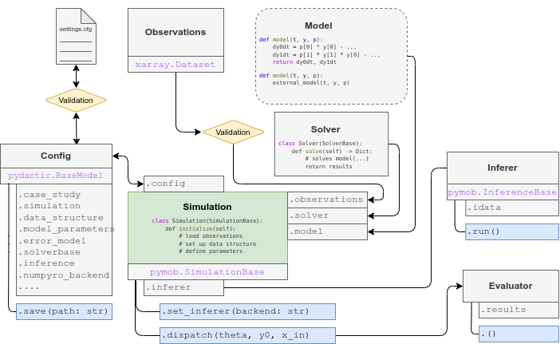

# Framework overview

Pymob is built around {class}`pymob.simulation.Simulation`, which is the object where all necessary information are pooled. For configuration, `pymob` relies on {class}`pymob.sim.config.Config`, which uses [`pydantic`](https://docs.pydantic.dev/latest/) to validate the configuration, before it is used to set up the simulation. 


```python
from pymob import SimulationBase

# initializing a Simulation with a config file
sim = SimulationBase(config="case_studies/quickstart/scenarios/test/settings.cfg")

# accessing the config file
sim.config
```


    Config(case_study=Casestudy(init_root='/home/flo-schu/projects/pymob/docs/source/user_guide', root='.', name='quickstart', scenario='test', package='case_studies', modules=['sim', 'mod', 'prob', 'data', 'plot'], simulation='Simulation', output=None, data=None, observations='observations.nc', logging='DEBUG', logfile=None, output_path='case_studies/quickstart/results/test', data_path='case_studies/quickstart/data', default_settings_path='case_studies/quickstart/scenarios/test/settings.cfg'), simulation=Simulation(model=None, solver=None, y0=[], x_in=[], input_files=[], n_ode_states=1, batch_dimension='batch_id', x_dimension='time', modeltype='deterministic', solver_post_processing=None, seed=1), data_structure=Datastructure(y=DataVariable(dimensions=['x'], min=-5.690912333645177, max=5.891166954282328, observed=True, dimensions_evaluator=None)), solverbase=Solverbase(x_dim='time', exclude_kwargs_model=('t', 'time', 'x_in', 'y', 'x', 'Y', 'X'), exclude_kwargs_postprocessing=('t', 'time', 'interpolation', 'results')), jaxsolver=Jaxsolver(diffrax_solver='Dopri5', rtol=1e-06, atol=1e-07, pcoeff=0.0, icoeff=1.0, dcoeff=0.0, max_steps=100000, throw_exception=True), inference=Inference(eps=1e-08, objective_function='total_average', n_objectives=1, objective_names=[], backend=None, extra_vars=[], plot=None, n_predictions=100), model_parameters=Modelparameters(a=Param(name=None, value=0.0, dims=(), prior=None, min=None, max=None, step=None, hyper=False, free=False), b=Param(name=None, value=3.0, dims=(), prior=RandomVariable(distribution='lognorm', parameters={'scale': 1, 's': 1}, obs=None, obs_inv=None), min=None, max=None, step=None, hyper=False, free=True), sigma_y=Param(name=None, value=0.0, dims=(), prior=RandomVariable(distribution='lognorm', parameters={'scale': 1, 's': 1}, obs=None, obs_inv=None), min=None, max=None, step=None, hyper=False, free=True)), error_model=Errormodel(y=RandomVariable(distribution='normal', parameters={'loc': y, 'scale': sigma_y}, obs=None, obs_inv=None)), multiprocessing=Multiprocessing(cores=1), inference_pyabc=Pyabc(sampler='SingleCoreSampler', population_size=100, minimum_epsilon=0.0, min_eps_diff=0.0, max_nr_populations=1000, database_path='/tmp/pyabc.db'), inference_pyabc_redis=Redis(password='nopassword', port=1111, n_predictions=50, history_id=-1, model_id=0), inference_pymoo=Pymoo(algortihm='UNSGA3', population_size=100, max_nr_populations=1000, ftol=1e-05, xtol=1e-07, cvtol=1e-07, verbose=True), inference_numpyro=Numpyro(user_defined_probability_model=None, user_defined_error_model=None, user_defined_preprocessing=None, gaussian_base_distribution=False, kernel='nuts', init_strategy='init_to_uniform', chains=1, draws=2000, warmup=1000, thinning=1, nuts_draws=2000, nuts_step_size=0.8, nuts_max_tree_depth=10, nuts_target_accept_prob=0.8, nuts_dense_mass=True, sa_adapt_state_size=None, svi_iterations=10000, svi_learning_rate=0.0001))


## Pymob API



### Pymob exposes the following input and output interfaces

#### Config

Pymob uses [`pydantic`](https://docs.pydantic.dev/latest/) Models for validation of the configuration files. The configuration is organized into sections, e.g.


```python
sim.config.data_structure
```


    Datastructure(y=DataVariable(dimensions=['x'], min=-5.690912333645177, max=5.891166954282328, observed=True, dimensions_evaluator=None))


Configurations can be changed in the files before a simulation is initialized from a config file, or directly in the script.


```python
sim.config.data_structure.y.min = 0
print(sim.config.data_structure.y)
```

    dimensions=['x'] min=0.0 max=5.891166954282328 observed=True dimensions_evaluator=None


As can be seen in the figure above, it is the communication between Simulation class and config files is bidirectional, this means, Simulations can be created from config files or in a scripting environment, and successively exported to config files. For more information see [configuration](case_studies.md#configuration) for details

#### Solver

Solvers solve the model. In order to automatize dimension handling and solving the model for the correct coordinates. Solvers subclass {class}`pymob.solver.SolverBase`. 


```python
sim.solver
```

#### Model

Models are provided as plain Python functions. 


```python
sim.model
```

#### Observations

Observations are required to be xarray Datasets. An [`xarray.Dataset`](https://docs.xarray.dev/en/stable/generated/xarray.Dataset.html) is a collection of annotated arrays, using HDF5 data formats for input/output operations.

#### Simulation results

Simulation results are returned by the solver. Plainly they are returned as dictionaries containing NDarrays. However, due to the information contained in the observations dataset, the results dictionary is automatically casted to an [`xarray.Dataset`](https://docs.xarray.dev/en/stable/generated/xarray.Dataset.html), which has the same shape as the observations. This makes comparisons between observations and simulations extremely easy.

#### Parameter estimates

Parameter estimates are harmonized by reporting them as [`arviz.InferenceData`](https://python.arviz.org/en/latest/getting_started/WorkingWithInferenceData.html) using `xarray.Datasets` under the hood. Thereby `pymob` supports variably dimensional datasets


## Parameter estimation

Parameter estimation is implemented through backends, which can be seen as converters between the {class}`pymob.simulation.SimulationBase` object and the API of the Inference tool. Inference backends are selected by using 


```python
sim.set_inferer("numpyro")
```

    Jax 64 bit mode: False
    Absolute tolerance: 1e-07


### Supported Algorithms and Planned Features

| Backend | Supported Algorithms | Inference | Hierarchical Models |
| :--- | --- | --- | --- |
| `numpyro` | Markov Chain Monte Carlo (MCMC), Stochastic Variational Inference (SVI) | ✅ | ✅ |
| `pymoo` | (Global) Multi-objective optimization | ✅ | plan |
| `pyabc` | Approximate Bayes | ✅ | plan |
| `scipy` | Local optimization (`minimize`) | dev | plan |
| `pymc` | MCMC | plan | plan |
| `sbi` | Simulation Based Inference (in planning) | hold | hold |
| `interactive ` | interactive backend in jupyter notebookswith parameter sliders | ✅ | plan |
