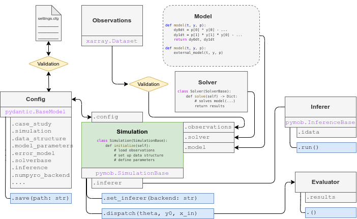
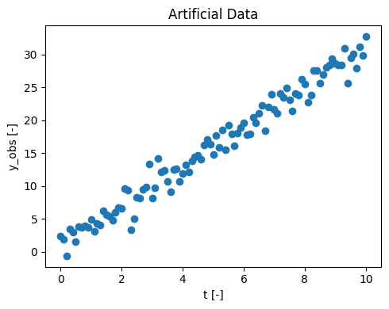
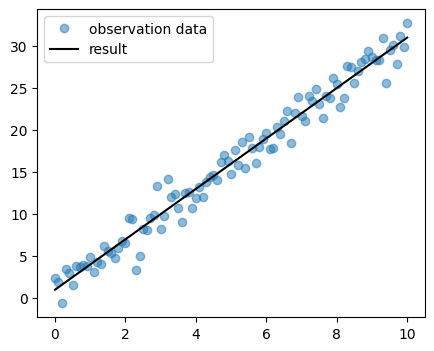
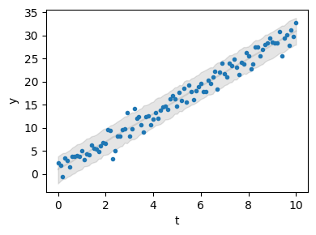
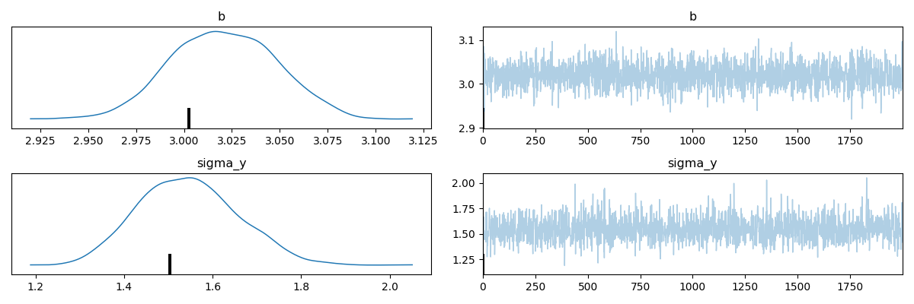
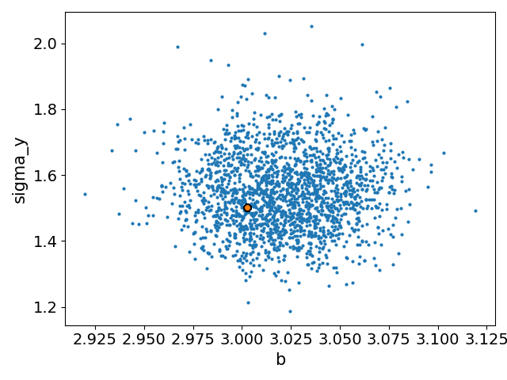

# Pymob in minutes - the basics

This guide provides a streamlined introduction to the basic Pymob workflow and its key functionalities.  
We will explore a simple linear regression model that we want to fit to a noisy dataset.  
Pymob supports the modeling process by providing several tools for *data structuring*, *parameter estimation* and *visualization of results*.  
  
If you are looking for a more detailed introduction, [click here](user_guide/Introduction).  
If you want to learn how to work with ODE models, check out [this tutorial](user_guide/advanced_tutorial_ODE_system). 

## Pymob components 🧩

Before starting the modeling process, let's take a look at the main steps and modules of pymob:

1. __Simulation:__   
First, we need to initialize a Simulation object by creating an instance of the {class}`pymob.simulation.SimulationBase` class from the simulation module.   
Optionally, we can configure the simulation with `sim.config.case_study.name = "linear-regression"`, `sim.config.case_study.scenario = "test"` and many other options. 

2. __Model:__   
Our model will be defined as a standard python function.  
We will then assign it to the Simulation object by accessing the `.model` attribute. 

3. __Observations:__   
Our observation data must be structured as an [xarray.Dataset](https://docs.xarray.dev/en/stable/generated/xarray.Dataset.html).  
We assign it to the {attr}`~pymob.simulation.SimulationBase.observations` attribute of our Simulation object.   
Calling `sim.config.data_structure` will give us further information about the layout of our data.  

4. __Solver:__  
A solver ({mod}`~pymob.solvers`) is required to solve the model.   
In our simple case, we will use the `solve_analytic_1d` solver from the {mod}`~pymob.solvers.analytic` module.  
We assign it to our Simulation object using the {attr}`~pymob.simulation.SimulationBase.solver` attribute.   
Since our model already provides an analytical solution, this solver basically does nothing. It is still needed to fulfill Pymob's requirement for a solver component.   
For more complex models (e.g. ODEs), the `JaxSolver` from the {mod}`~pymob.solvers.diffrax` module is a more powerful option.   
Users can also implement custom solvers as a subclass of {class}`pymob.solvers.base.SolverBase`. 
  
5. __Inferer:__  
The inferer handels the parameter estimation.  
Pymob supports [various backends](https://pymob.readthedocs.io/en/stable/user_guide/framework_overview.html). In this example, we will work with *NumPyro*.  
We assign the inferer to our Simulation object via the {attr}`~pymob.simulation.SimulationBase.inferer` attribute and configure the desired kernel (e.g. *nuts*).  
But before inference, we need to parameterize our model using the {class}`~pymob.sim.parameters.Param` class.   
Each parameter can be marked either as free or fixed, depending on whether it should be variable during the optimization procedure.   
The parameters are stored in the {attr}`~pymob.simulation.SimulationBase.model_parameters` dictionary, which holds model input values.
By default, it takes the keys: `parameters`, `y0` and `x_in`. 

6. __Evaluator:__  
The Evaluator is an instance to manage model evaluations. It sets up tasks, coordinates parallel runs of the simulation and keeps track of the results from each simulation or parameter inference process.   
Evaluators store the raw output from a simulation and can generate an xarray object from it that corresponds to the data-structure of the observations with the {attr}`~pymob.sim.evaluator.Evaluator.results` property. This automatically aligns the simulations results with the observations, for simple computation of loss functions.  

7. __Config:__  
The simulation settings will be saved in a `.cfg` configuration file.  
The config file contains information about our simulation in various sections. [Learn more here](case_studies.md#configuration).  
We can further use it to create new simulations by loading settings from a config file. 



## Getting started 🛫


```python
# First, import the necessary python packages
import numpy as np
import matplotlib.pyplot as plt
import xarray as xr

# Import the pymob modules
from pymob.simulation import SimulationBase
from pymob.sim.solvetools import solve_analytic_1d
from pymob.sim.config import Param
```

Since no measured data is provided, we will generate an artificial dataset.  
$y_{obs}$ represents the **observed data** over the time $t$ [0, 10].  
To use this data later in the simulation, we need to convert it into an **xarray dataset**.  
In your own application, you would replace this with your measured experimental data.  


```python
# Parameter for the artificial data generation
rng = np.random.default_rng(seed=1)  # for reproducibility
slope = rng.uniform(2,4)
intercept = 1.0
num_points = 101
noise_level = 1.7

# generating time values
t = np.linspace(0, 10, num_points)

# generating y-values with noise
noise = rng.normal(0, noise_level, num_points)
y_obs = slope * t + intercept + noise

# visualizing our data
fig, ax = plt.subplots(figsize=(5, 4))
ax.scatter(t, y_obs, label='Datapoints')
ax.set(xlabel='t [-]', ylabel='y_obs [-]', title ='Artificial Data')
plt.tight_layout()

# convert the data to an xr-Dataset
data_obs = xr.DataArray(y_obs, coords={"t": t}).to_dataset(name="y")
data_obs
```


<div><svg style="position: absolute; width: 0; height: 0; overflow: hidden">
<defs>
<symbol id="icon-database" viewBox="0 0 32 32">
<path d="M16 0c-8.837 0-16 2.239-16 5v4c0 2.761 7.163 5 16 5s16-2.239 16-5v-4c0-2.761-7.163-5-16-5z"></path>
<path d="M16 17c-8.837 0-16-2.239-16-5v6c0 2.761 7.163 5 16 5s16-2.239 16-5v-6c0 2.761-7.163 5-16 5z"></path>
<path d="M16 26c-8.837 0-16-2.239-16-5v6c0 2.761 7.163 5 16 5s16-2.239 16-5v-6c0 2.761-7.163 5-16 5z"></path>
</symbol>
<symbol id="icon-file-text2" viewBox="0 0 32 32">
<path d="M28.681 7.159c-0.694-0.947-1.662-2.053-2.724-3.116s-2.169-2.030-3.116-2.724c-1.612-1.182-2.393-1.319-2.841-1.319h-15.5c-1.378 0-2.5 1.121-2.5 2.5v27c0 1.378 1.122 2.5 2.5 2.5h23c1.378 0 2.5-1.122 2.5-2.5v-19.5c0-0.448-0.137-1.23-1.319-2.841zM24.543 5.457c0.959 0.959 1.712 1.825 2.268 2.543h-4.811v-4.811c0.718 0.556 1.584 1.309 2.543 2.268zM28 29.5c0 0.271-0.229 0.5-0.5 0.5h-23c-0.271 0-0.5-0.229-0.5-0.5v-27c0-0.271 0.229-0.5 0.5-0.5 0 0 15.499-0 15.5 0v7c0 0.552 0.448 1 1 1h7v19.5z"></path>
<path d="M23 26h-14c-0.552 0-1-0.448-1-1s0.448-1 1-1h14c0.552 0 1 0.448 1 1s-0.448 1-1 1z"></path>
<path d="M23 22h-14c-0.552 0-1-0.448-1-1s0.448-1 1-1h14c0.552 0 1 0.448 1 1s-0.448 1-1 1z"></path>
<path d="M23 18h-14c-0.552 0-1-0.448-1-1s0.448-1 1-1h14c0.552 0 1 0.448 1 1s-0.448 1-1 1z"></path>
</symbol>
</defs>
</svg>
<style>/* CSS stylesheet for displaying xarray objects in jupyterlab.
 *
 */

:root {
  --xr-font-color0: var(--jp-content-font-color0, rgba(0, 0, 0, 1));
  --xr-font-color2: var(--jp-content-font-color2, rgba(0, 0, 0, 0.54));
  --xr-font-color3: var(--jp-content-font-color3, rgba(0, 0, 0, 0.38));
  --xr-border-color: var(--jp-border-color2, #e0e0e0);
  --xr-disabled-color: var(--jp-layout-color3, #bdbdbd);
  --xr-background-color: var(--jp-layout-color0, white);
  --xr-background-color-row-even: var(--jp-layout-color1, white);
  --xr-background-color-row-odd: var(--jp-layout-color2, #eeeeee);
}

html[theme=dark],
body[data-theme=dark],
body.vscode-dark {
  --xr-font-color0: rgba(255, 255, 255, 1);
  --xr-font-color2: rgba(255, 255, 255, 0.54);
  --xr-font-color3: rgba(255, 255, 255, 0.38);
  --xr-border-color: #1F1F1F;
  --xr-disabled-color: #515151;
  --xr-background-color: #111111;
  --xr-background-color-row-even: #111111;
  --xr-background-color-row-odd: #313131;
}

.xr-wrap {
  display: block !important;
  min-width: 300px;
  max-width: 700px;
}

.xr-text-repr-fallback {
  /* fallback to plain text repr when CSS is not injected (untrusted notebook) */
  display: none;
}

.xr-header {
  padding-top: 6px;
  padding-bottom: 6px;
  margin-bottom: 4px;
  border-bottom: solid 1px var(--xr-border-color);
}

.xr-header > div,
.xr-header > ul {
  display: inline;
  margin-top: 0;
  margin-bottom: 0;
}

.xr-obj-type,
.xr-array-name {
  margin-left: 2px;
  margin-right: 10px;
}

.xr-obj-type {
  color: var(--xr-font-color2);
}

.xr-sections {
  padding-left: 0 !important;
  display: grid;
  grid-template-columns: 150px auto auto 1fr 20px 20px;
}

.xr-section-item {
  display: contents;
}

.xr-section-item input {
  display: none;
}

.xr-section-item input + label {
  color: var(--xr-disabled-color);
}

.xr-section-item input:enabled + label {
  cursor: pointer;
  color: var(--xr-font-color2);
}

.xr-section-item input:enabled + label:hover {
  color: var(--xr-font-color0);
}

.xr-section-summary {
  grid-column: 1;
  color: var(--xr-font-color2);
  font-weight: 500;
}

.xr-section-summary > span {
  display: inline-block;
  padding-left: 0.5em;
}

.xr-section-summary-in:disabled + label {
  color: var(--xr-font-color2);
}

.xr-section-summary-in + label:before {
  display: inline-block;
  content: '►';
  font-size: 11px;
  width: 15px;
  text-align: center;
}

.xr-section-summary-in:disabled + label:before {
  color: var(--xr-disabled-color);
}

.xr-section-summary-in:checked + label:before {
  content: '▼';
}

.xr-section-summary-in:checked + label > span {
  display: none;
}

.xr-section-summary,
.xr-section-inline-details {
  padding-top: 4px;
  padding-bottom: 4px;
}

.xr-section-inline-details {
  grid-column: 2 / -1;
}

.xr-section-details {
  display: none;
  grid-column: 1 / -1;
  margin-bottom: 5px;
}

.xr-section-summary-in:checked ~ .xr-section-details {
  display: contents;
}

.xr-array-wrap {
  grid-column: 1 / -1;
  display: grid;
  grid-template-columns: 20px auto;
}

.xr-array-wrap > label {
  grid-column: 1;
  vertical-align: top;
}

.xr-preview {
  color: var(--xr-font-color3);
}

.xr-array-preview,
.xr-array-data {
  padding: 0 5px !important;
  grid-column: 2;
}

.xr-array-data,
.xr-array-in:checked ~ .xr-array-preview {
  display: none;
}

.xr-array-in:checked ~ .xr-array-data,
.xr-array-preview {
  display: inline-block;
}

.xr-dim-list {
  display: inline-block !important;
  list-style: none;
  padding: 0 !important;
  margin: 0;
}

.xr-dim-list li {
  display: inline-block;
  padding: 0;
  margin: 0;
}

.xr-dim-list:before {
  content: '(';
}

.xr-dim-list:after {
  content: ')';
}

.xr-dim-list li:not(:last-child):after {
  content: ',';
  padding-right: 5px;
}

.xr-has-index {
  font-weight: bold;
}

.xr-var-list,
.xr-var-item {
  display: contents;
}

.xr-var-item > div,
.xr-var-item label,
.xr-var-item > .xr-var-name span {
  background-color: var(--xr-background-color-row-even);
  margin-bottom: 0;
}

.xr-var-item > .xr-var-name:hover span {
  padding-right: 5px;
}

.xr-var-list > li:nth-child(odd) > div,
.xr-var-list > li:nth-child(odd) > label,
.xr-var-list > li:nth-child(odd) > .xr-var-name span {
  background-color: var(--xr-background-color-row-odd);
}

.xr-var-name {
  grid-column: 1;
}

.xr-var-dims {
  grid-column: 2;
}

.xr-var-dtype {
  grid-column: 3;
  text-align: right;
  color: var(--xr-font-color2);
}

.xr-var-preview {
  grid-column: 4;
}

.xr-index-preview {
  grid-column: 2 / 5;
  color: var(--xr-font-color2);
}

.xr-var-name,
.xr-var-dims,
.xr-var-dtype,
.xr-preview,
.xr-attrs dt {
  white-space: nowrap;
  overflow: hidden;
  text-overflow: ellipsis;
  padding-right: 10px;
}

.xr-var-name:hover,
.xr-var-dims:hover,
.xr-var-dtype:hover,
.xr-attrs dt:hover {
  overflow: visible;
  width: auto;
  z-index: 1;
}

.xr-var-attrs,
.xr-var-data,
.xr-index-data {
  display: none;
  background-color: var(--xr-background-color) !important;
  padding-bottom: 5px !important;
}

.xr-var-attrs-in:checked ~ .xr-var-attrs,
.xr-var-data-in:checked ~ .xr-var-data,
.xr-index-data-in:checked ~ .xr-index-data {
  display: block;
}

.xr-var-data > table {
  float: right;
}

.xr-var-name span,
.xr-var-data,
.xr-index-name div,
.xr-index-data,
.xr-attrs {
  padding-left: 25px !important;
}

.xr-attrs,
.xr-var-attrs,
.xr-var-data,
.xr-index-data {
  grid-column: 1 / -1;
}

dl.xr-attrs {
  padding: 0;
  margin: 0;
  display: grid;
  grid-template-columns: 125px auto;
}

.xr-attrs dt,
.xr-attrs dd {
  padding: 0;
  margin: 0;
  float: left;
  padding-right: 10px;
  width: auto;
}

.xr-attrs dt {
  font-weight: normal;
  grid-column: 1;
}

.xr-attrs dt:hover span {
  display: inline-block;
  background: var(--xr-background-color);
  padding-right: 10px;
}

.xr-attrs dd {
  grid-column: 2;
  white-space: pre-wrap;
  word-break: break-all;
}

.xr-icon-database,
.xr-icon-file-text2,
.xr-no-icon {
  display: inline-block;
  vertical-align: middle;
  width: 1em;
  height: 1.5em !important;
  stroke-width: 0;
  stroke: currentColor;
  fill: currentColor;
}
</style><pre class='xr-text-repr-fallback'>&lt;xarray.Dataset&gt;
Dimensions:  (t: 101)
Coordinates:
  * t        (t) float64 0.0 0.1 0.2 0.3 0.4 0.5 ... 9.5 9.6 9.7 9.8 9.9 10.0
Data variables:
    y        (t) float64 2.397 1.864 -0.6106 3.446 ... 27.91 31.2 29.83 32.7</pre><div class='xr-wrap' style='display:none'><div class='xr-header'><div class='xr-obj-type'>xarray.Dataset</div></div><ul class='xr-sections'><li class='xr-section-item'><input id='section-049006e1-a9d9-45ed-934e-f4d1852ec8c8' class='xr-section-summary-in' type='checkbox' disabled ><label for='section-049006e1-a9d9-45ed-934e-f4d1852ec8c8' class='xr-section-summary'  title='Expand/collapse section'>Dimensions:</label><div class='xr-section-inline-details'><ul class='xr-dim-list'><li><span class='xr-has-index'>t</span>: 101</li></ul></div><div class='xr-section-details'></div></li><li class='xr-section-item'><input id='section-449bda9c-9dd3-40e4-9b2f-ca3f64797f3d' class='xr-section-summary-in' type='checkbox'  checked><label for='section-449bda9c-9dd3-40e4-9b2f-ca3f64797f3d' class='xr-section-summary' >Coordinates: <span>(1)</span></label><div class='xr-section-inline-details'></div><div class='xr-section-details'><ul class='xr-var-list'><li class='xr-var-item'><div class='xr-var-name'><span class='xr-has-index'>t</span></div><div class='xr-var-dims'>(t)</div><div class='xr-var-dtype'>float64</div><div class='xr-var-preview xr-preview'>0.0 0.1 0.2 0.3 ... 9.8 9.9 10.0</div><input id='attrs-12c1857f-264b-42e6-a1c8-cee6306c2bc5' class='xr-var-attrs-in' type='checkbox' disabled><label for='attrs-12c1857f-264b-42e6-a1c8-cee6306c2bc5' title='Show/Hide attributes'><svg class='icon xr-icon-file-text2'><use xlink:href='#icon-file-text2'></use></svg></label><input id='data-686e7661-7314-4caa-9657-c6f76d24bcfb' class='xr-var-data-in' type='checkbox'><label for='data-686e7661-7314-4caa-9657-c6f76d24bcfb' title='Show/Hide data repr'><svg class='icon xr-icon-database'><use xlink:href='#icon-database'></use></svg></label><div class='xr-var-attrs'><dl class='xr-attrs'></dl></div><div class='xr-var-data'><pre>array([ 0. ,  0.1,  0.2,  0.3,  0.4,  0.5,  0.6,  0.7,  0.8,  0.9,  1. ,  1.1,
        1.2,  1.3,  1.4,  1.5,  1.6,  1.7,  1.8,  1.9,  2. ,  2.1,  2.2,  2.3,
        2.4,  2.5,  2.6,  2.7,  2.8,  2.9,  3. ,  3.1,  3.2,  3.3,  3.4,  3.5,
        3.6,  3.7,  3.8,  3.9,  4. ,  4.1,  4.2,  4.3,  4.4,  4.5,  4.6,  4.7,
        4.8,  4.9,  5. ,  5.1,  5.2,  5.3,  5.4,  5.5,  5.6,  5.7,  5.8,  5.9,
        6. ,  6.1,  6.2,  6.3,  6.4,  6.5,  6.6,  6.7,  6.8,  6.9,  7. ,  7.1,
        7.2,  7.3,  7.4,  7.5,  7.6,  7.7,  7.8,  7.9,  8. ,  8.1,  8.2,  8.3,
        8.4,  8.5,  8.6,  8.7,  8.8,  8.9,  9. ,  9.1,  9.2,  9.3,  9.4,  9.5,
        9.6,  9.7,  9.8,  9.9, 10. ])</pre></div></li></ul></div></li><li class='xr-section-item'><input id='section-53b19c3b-520b-4b55-8e54-c609453d54da' class='xr-section-summary-in' type='checkbox'  checked><label for='section-53b19c3b-520b-4b55-8e54-c609453d54da' class='xr-section-summary' >Data variables: <span>(1)</span></label><div class='xr-section-inline-details'></div><div class='xr-section-details'><ul class='xr-var-list'><li class='xr-var-item'><div class='xr-var-name'><span>y</span></div><div class='xr-var-dims'>(t)</div><div class='xr-var-dtype'>float64</div><div class='xr-var-preview xr-preview'>2.397 1.864 -0.6106 ... 29.83 32.7</div><input id='attrs-212636d2-7525-49c4-b7c1-628485b1f50a' class='xr-var-attrs-in' type='checkbox' disabled><label for='attrs-212636d2-7525-49c4-b7c1-628485b1f50a' title='Show/Hide attributes'><svg class='icon xr-icon-file-text2'><use xlink:href='#icon-file-text2'></use></svg></label><input id='data-d6cc4ce8-183f-447d-b88d-ae7c69e00c48' class='xr-var-data-in' type='checkbox'><label for='data-d6cc4ce8-183f-447d-b88d-ae7c69e00c48' title='Show/Hide data repr'><svg class='icon xr-icon-database'><use xlink:href='#icon-database'></use></svg></label><div class='xr-var-attrs'><dl class='xr-attrs'></dl></div><div class='xr-var-data'><pre>array([ 2.39675084,  1.86410735, -0.61063864,  3.44619795,  2.96829407,
        1.59900112,  3.80208673,  3.73632335,  3.91893984,  3.76959673,
        4.95305533,  3.07403563,  4.35142499,  4.11113339,  6.25113911,
        5.60299246,  5.34065272,  4.81094914,  6.00533104,  6.75876388,
        6.57876156,  9.54955931,  9.36344648,  3.34540326,  5.04542128,
        8.26199557,  8.14374875,  9.52702987,  9.83564838, 13.36889131,
        8.18049445,  9.73136556, 14.14837013, 12.07741782, 12.40759478,
       10.70894054,  9.08338791, 12.47217009, 12.6751683 , 10.70571018,
       11.93308767, 13.27446307, 12.09322389, 13.83460703, 14.46635144,
       14.66689123, 14.04806313, 16.22049499, 17.02847142, 16.36129404,
       14.72722486, 17.66438945, 15.87049687, 18.51988227, 15.50563494,
       19.18463212, 17.89829432, 16.11189341, 18.00350174, 18.93146905,
       19.60560477, 17.77450401, 17.86405397, 20.38824618, 19.55784245,
       21.05404066, 22.24722863, 18.45547125, 21.99323389, 23.94503827,
       21.65970711, 21.08948228, 24.0490459 , 23.5034548 , 24.89796127,
       23.09045766, 21.46059763, 24.09503472, 23.82650949, 26.20483217,
       25.51832184, 22.71906663, 23.76209741, 27.59868033, 27.55420382,
       25.6125539 , 27.00154899, 28.06317131, 28.40434797, 29.40003665,
       28.64881481, 28.35394539, 28.37747618, 30.91464498, 25.59579428,
       29.48889682, 30.08307537, 27.90624629, 31.19748699, 29.82689045,
       32.70258865])</pre></div></li></ul></div></li><li class='xr-section-item'><input id='section-f29d9753-e215-4dfa-8759-3166045fd5f5' class='xr-section-summary-in' type='checkbox'  ><label for='section-f29d9753-e215-4dfa-8759-3166045fd5f5' class='xr-section-summary' >Indexes: <span>(1)</span></label><div class='xr-section-inline-details'></div><div class='xr-section-details'><ul class='xr-var-list'><li class='xr-var-item'><div class='xr-index-name'><div>t</div></div><div class='xr-index-preview'>PandasIndex</div><div></div><input id='index-98d4055b-d47a-402c-9210-3bf87f396cb5' class='xr-index-data-in' type='checkbox'/><label for='index-98d4055b-d47a-402c-9210-3bf87f396cb5' title='Show/Hide index repr'><svg class='icon xr-icon-database'><use xlink:href='#icon-database'></use></svg></label><div class='xr-index-data'><pre>PandasIndex(Index([                0.0,                 0.1,                 0.2,
       0.30000000000000004,                 0.4,                 0.5,
        0.6000000000000001,  0.7000000000000001,                 0.8,
                       0.9,
       ...
                       9.1,   9.200000000000001,                 9.3,
                       9.4,                 9.5,   9.600000000000001,
         9.700000000000001,                 9.8,                 9.9,
                      10.0],
      dtype=&#x27;float64&#x27;, name=&#x27;t&#x27;, length=101))</pre></div></li></ul></div></li><li class='xr-section-item'><input id='section-933c7493-6322-4b0e-9b41-46b6be8f9d50' class='xr-section-summary-in' type='checkbox' disabled ><label for='section-933c7493-6322-4b0e-9b41-46b6be8f9d50' class='xr-section-summary'  title='Expand/collapse section'>Attributes: <span>(0)</span></label><div class='xr-section-inline-details'></div><div class='xr-section-details'><dl class='xr-attrs'></dl></div></li></ul></div></div>


    

    


## Initialize a simulation ✨

In pymob, a **simulation object** is initialized by creating an instance of the {class}`~pymob.simulation.SimulationBase` class from the simulation module.  
We will choose a linear regression model, as it provides a good approximation of the data: $ y = a + b*x $

```{admonition} x-dimension
:class: note
The x_dimension of our simulation can have any name, for example t as often used for time series data.
You can specify it via `sim.config.simulation.x_dimension`.
```


```python
# Initialize the Simulation object
sim = SimulationBase()

# configurate the case study
sim.config.case_study.name = "superquickstart"
sim.config.case_study.scenario = "linreg"

# Define the linear regression model
def linreg(x, a, b):
    return a + b * x

# Add the model to the simulation
sim.model = linreg

# Adding our dataset to the simulation
sim.observations = data_obs

# Defining a solver
sim.solver = solve_analytic_1d

# Take a look at the layut of the data
sim.config.data_structure
```

    MinMaxScaler(variable=y, min=-0.6106386438473108, max=32.702588647741905)


    /export/home/fschunck/miniconda3/envs/pymob/lib/python3.11/site-packages/pymob/simulation.py:361: UserWarning: `sim.config.data_structure.y = Datavariable(dimensions=['t'] min=-0.6106386438473108 max=32.702588647741905 observed=True dimensions_evaluator=None)` has been assumed from `sim.observations`. If the order of the dimensions should be different, specify `sim.config.data_structure.y = DataVariable(dimensions=[...], ...)` manually.
      warnings.warn(


    Datastructure(y=DataVariable(dimensions=['t'], min=-0.6106386438473108, max=32.702588647741905, observed=True, dimensions_evaluator=None))


```{admonition} Scalers
:class: note
We notice a mysterious Scaler message. This tells us that our data variable has been identified and a scaler was constructed, which transforms the variable between [0, 1].   
This has no effect at the moment, but it can be used later. Scaling can be powerful to help parameter estimation in more complex models.
```


## Parameterizing and running the model 🏃

Next, we define the **model parameters** $a$ and $b$.  
Parameter $a$ is set as fixed (`free = False`), meaning its value is known and will not be estimated during optimization.  
Parameter $b$ is marked as free (`free = True`), allowing it to be optimized to fit the data. As an initial guess, we assume $b = 3$.   


```python
# Parameterizing the model
sim.config.model_parameters.a = Param(value=1.0, free=False)
sim.config.model_parameters.b = Param(value=3.0, free=True)
# this makes sure the model parameters are available to the model.
sim.model_parameters["parameters"] = sim.config.model_parameters.value_dict

sim.model_parameters["parameters"] 
```


    {'a': 1.0, 'b': 3.0}


Our model is now prepared with a defined parameter set.  
To initialize the **Evaluator**, we call {meth}`~pymob.simulation.SimulationBase.dispatch_constructor()`.   
This step is essential and must be executed every time changes are made to the model. 

The returned dataset (`evaluator.results`) has the exact same shape as the observation data.


```python
# put everything in place for running the simulation
sim.dispatch_constructor()

# run
evaluator = sim.dispatch(theta={"b":3})
evaluator()
evaluator.results
```

    /export/home/fschunck/miniconda3/envs/pymob/lib/python3.11/site-packages/pymob/simulation.py:688: UserWarning: The number of ODE states was not specified in the config file [simulation] > 'n_ode_states = <n>'. Extracted the return arguments ['a+b*x'] from the source code. Setting 'n_ode_states=1.
      warnings.warn(


<div><svg style="position: absolute; width: 0; height: 0; overflow: hidden">
<defs>
<symbol id="icon-database" viewBox="0 0 32 32">
<path d="M16 0c-8.837 0-16 2.239-16 5v4c0 2.761 7.163 5 16 5s16-2.239 16-5v-4c0-2.761-7.163-5-16-5z"></path>
<path d="M16 17c-8.837 0-16-2.239-16-5v6c0 2.761 7.163 5 16 5s16-2.239 16-5v-6c0 2.761-7.163 5-16 5z"></path>
<path d="M16 26c-8.837 0-16-2.239-16-5v6c0 2.761 7.163 5 16 5s16-2.239 16-5v-6c0 2.761-7.163 5-16 5z"></path>
</symbol>
<symbol id="icon-file-text2" viewBox="0 0 32 32">
<path d="M28.681 7.159c-0.694-0.947-1.662-2.053-2.724-3.116s-2.169-2.030-3.116-2.724c-1.612-1.182-2.393-1.319-2.841-1.319h-15.5c-1.378 0-2.5 1.121-2.5 2.5v27c0 1.378 1.122 2.5 2.5 2.5h23c1.378 0 2.5-1.122 2.5-2.5v-19.5c0-0.448-0.137-1.23-1.319-2.841zM24.543 5.457c0.959 0.959 1.712 1.825 2.268 2.543h-4.811v-4.811c0.718 0.556 1.584 1.309 2.543 2.268zM28 29.5c0 0.271-0.229 0.5-0.5 0.5h-23c-0.271 0-0.5-0.229-0.5-0.5v-27c0-0.271 0.229-0.5 0.5-0.5 0 0 15.499-0 15.5 0v7c0 0.552 0.448 1 1 1h7v19.5z"></path>
<path d="M23 26h-14c-0.552 0-1-0.448-1-1s0.448-1 1-1h14c0.552 0 1 0.448 1 1s-0.448 1-1 1z"></path>
<path d="M23 22h-14c-0.552 0-1-0.448-1-1s0.448-1 1-1h14c0.552 0 1 0.448 1 1s-0.448 1-1 1z"></path>
<path d="M23 18h-14c-0.552 0-1-0.448-1-1s0.448-1 1-1h14c0.552 0 1 0.448 1 1s-0.448 1-1 1z"></path>
</symbol>
</defs>
</svg>
<style>/* CSS stylesheet for displaying xarray objects in jupyterlab.
 *
 */

:root {
  --xr-font-color0: var(--jp-content-font-color0, rgba(0, 0, 0, 1));
  --xr-font-color2: var(--jp-content-font-color2, rgba(0, 0, 0, 0.54));
  --xr-font-color3: var(--jp-content-font-color3, rgba(0, 0, 0, 0.38));
  --xr-border-color: var(--jp-border-color2, #e0e0e0);
  --xr-disabled-color: var(--jp-layout-color3, #bdbdbd);
  --xr-background-color: var(--jp-layout-color0, white);
  --xr-background-color-row-even: var(--jp-layout-color1, white);
  --xr-background-color-row-odd: var(--jp-layout-color2, #eeeeee);
}

html[theme=dark],
body[data-theme=dark],
body.vscode-dark {
  --xr-font-color0: rgba(255, 255, 255, 1);
  --xr-font-color2: rgba(255, 255, 255, 0.54);
  --xr-font-color3: rgba(255, 255, 255, 0.38);
  --xr-border-color: #1F1F1F;
  --xr-disabled-color: #515151;
  --xr-background-color: #111111;
  --xr-background-color-row-even: #111111;
  --xr-background-color-row-odd: #313131;
}

.xr-wrap {
  display: block !important;
  min-width: 300px;
  max-width: 700px;
}

.xr-text-repr-fallback {
  /* fallback to plain text repr when CSS is not injected (untrusted notebook) */
  display: none;
}

.xr-header {
  padding-top: 6px;
  padding-bottom: 6px;
  margin-bottom: 4px;
  border-bottom: solid 1px var(--xr-border-color);
}

.xr-header > div,
.xr-header > ul {
  display: inline;
  margin-top: 0;
  margin-bottom: 0;
}

.xr-obj-type,
.xr-array-name {
  margin-left: 2px;
  margin-right: 10px;
}

.xr-obj-type {
  color: var(--xr-font-color2);
}

.xr-sections {
  padding-left: 0 !important;
  display: grid;
  grid-template-columns: 150px auto auto 1fr 20px 20px;
}

.xr-section-item {
  display: contents;
}

.xr-section-item input {
  display: none;
}

.xr-section-item input + label {
  color: var(--xr-disabled-color);
}

.xr-section-item input:enabled + label {
  cursor: pointer;
  color: var(--xr-font-color2);
}

.xr-section-item input:enabled + label:hover {
  color: var(--xr-font-color0);
}

.xr-section-summary {
  grid-column: 1;
  color: var(--xr-font-color2);
  font-weight: 500;
}

.xr-section-summary > span {
  display: inline-block;
  padding-left: 0.5em;
}

.xr-section-summary-in:disabled + label {
  color: var(--xr-font-color2);
}

.xr-section-summary-in + label:before {
  display: inline-block;
  content: '►';
  font-size: 11px;
  width: 15px;
  text-align: center;
}

.xr-section-summary-in:disabled + label:before {
  color: var(--xr-disabled-color);
}

.xr-section-summary-in:checked + label:before {
  content: '▼';
}

.xr-section-summary-in:checked + label > span {
  display: none;
}

.xr-section-summary,
.xr-section-inline-details {
  padding-top: 4px;
  padding-bottom: 4px;
}

.xr-section-inline-details {
  grid-column: 2 / -1;
}

.xr-section-details {
  display: none;
  grid-column: 1 / -1;
  margin-bottom: 5px;
}

.xr-section-summary-in:checked ~ .xr-section-details {
  display: contents;
}

.xr-array-wrap {
  grid-column: 1 / -1;
  display: grid;
  grid-template-columns: 20px auto;
}

.xr-array-wrap > label {
  grid-column: 1;
  vertical-align: top;
}

.xr-preview {
  color: var(--xr-font-color3);
}

.xr-array-preview,
.xr-array-data {
  padding: 0 5px !important;
  grid-column: 2;
}

.xr-array-data,
.xr-array-in:checked ~ .xr-array-preview {
  display: none;
}

.xr-array-in:checked ~ .xr-array-data,
.xr-array-preview {
  display: inline-block;
}

.xr-dim-list {
  display: inline-block !important;
  list-style: none;
  padding: 0 !important;
  margin: 0;
}

.xr-dim-list li {
  display: inline-block;
  padding: 0;
  margin: 0;
}

.xr-dim-list:before {
  content: '(';
}

.xr-dim-list:after {
  content: ')';
}

.xr-dim-list li:not(:last-child):after {
  content: ',';
  padding-right: 5px;
}

.xr-has-index {
  font-weight: bold;
}

.xr-var-list,
.xr-var-item {
  display: contents;
}

.xr-var-item > div,
.xr-var-item label,
.xr-var-item > .xr-var-name span {
  background-color: var(--xr-background-color-row-even);
  margin-bottom: 0;
}

.xr-var-item > .xr-var-name:hover span {
  padding-right: 5px;
}

.xr-var-list > li:nth-child(odd) > div,
.xr-var-list > li:nth-child(odd) > label,
.xr-var-list > li:nth-child(odd) > .xr-var-name span {
  background-color: var(--xr-background-color-row-odd);
}

.xr-var-name {
  grid-column: 1;
}

.xr-var-dims {
  grid-column: 2;
}

.xr-var-dtype {
  grid-column: 3;
  text-align: right;
  color: var(--xr-font-color2);
}

.xr-var-preview {
  grid-column: 4;
}

.xr-index-preview {
  grid-column: 2 / 5;
  color: var(--xr-font-color2);
}

.xr-var-name,
.xr-var-dims,
.xr-var-dtype,
.xr-preview,
.xr-attrs dt {
  white-space: nowrap;
  overflow: hidden;
  text-overflow: ellipsis;
  padding-right: 10px;
}

.xr-var-name:hover,
.xr-var-dims:hover,
.xr-var-dtype:hover,
.xr-attrs dt:hover {
  overflow: visible;
  width: auto;
  z-index: 1;
}

.xr-var-attrs,
.xr-var-data,
.xr-index-data {
  display: none;
  background-color: var(--xr-background-color) !important;
  padding-bottom: 5px !important;
}

.xr-var-attrs-in:checked ~ .xr-var-attrs,
.xr-var-data-in:checked ~ .xr-var-data,
.xr-index-data-in:checked ~ .xr-index-data {
  display: block;
}

.xr-var-data > table {
  float: right;
}

.xr-var-name span,
.xr-var-data,
.xr-index-name div,
.xr-index-data,
.xr-attrs {
  padding-left: 25px !important;
}

.xr-attrs,
.xr-var-attrs,
.xr-var-data,
.xr-index-data {
  grid-column: 1 / -1;
}

dl.xr-attrs {
  padding: 0;
  margin: 0;
  display: grid;
  grid-template-columns: 125px auto;
}

.xr-attrs dt,
.xr-attrs dd {
  padding: 0;
  margin: 0;
  float: left;
  padding-right: 10px;
  width: auto;
}

.xr-attrs dt {
  font-weight: normal;
  grid-column: 1;
}

.xr-attrs dt:hover span {
  display: inline-block;
  background: var(--xr-background-color);
  padding-right: 10px;
}

.xr-attrs dd {
  grid-column: 2;
  white-space: pre-wrap;
  word-break: break-all;
}

.xr-icon-database,
.xr-icon-file-text2,
.xr-no-icon {
  display: inline-block;
  vertical-align: middle;
  width: 1em;
  height: 1.5em !important;
  stroke-width: 0;
  stroke: currentColor;
  fill: currentColor;
}
</style><pre class='xr-text-repr-fallback'>&lt;xarray.Dataset&gt;
Dimensions:  (t: 101)
Coordinates:
  * t        (t) float64 0.0 0.1 0.2 0.3 0.4 0.5 ... 9.5 9.6 9.7 9.8 9.9 10.0
Data variables:
    y        (t) float64 1.0 1.3 1.6 1.9 2.2 2.5 ... 29.8 30.1 30.4 30.7 31.0</pre><div class='xr-wrap' style='display:none'><div class='xr-header'><div class='xr-obj-type'>xarray.Dataset</div></div><ul class='xr-sections'><li class='xr-section-item'><input id='section-094dfbc7-81da-40c0-8f45-607a1771ee2f' class='xr-section-summary-in' type='checkbox' disabled ><label for='section-094dfbc7-81da-40c0-8f45-607a1771ee2f' class='xr-section-summary'  title='Expand/collapse section'>Dimensions:</label><div class='xr-section-inline-details'><ul class='xr-dim-list'><li><span class='xr-has-index'>t</span>: 101</li></ul></div><div class='xr-section-details'></div></li><li class='xr-section-item'><input id='section-d3d0ca25-11b2-43de-aba6-bc158f138788' class='xr-section-summary-in' type='checkbox'  checked><label for='section-d3d0ca25-11b2-43de-aba6-bc158f138788' class='xr-section-summary' >Coordinates: <span>(1)</span></label><div class='xr-section-inline-details'></div><div class='xr-section-details'><ul class='xr-var-list'><li class='xr-var-item'><div class='xr-var-name'><span class='xr-has-index'>t</span></div><div class='xr-var-dims'>(t)</div><div class='xr-var-dtype'>float64</div><div class='xr-var-preview xr-preview'>0.0 0.1 0.2 0.3 ... 9.8 9.9 10.0</div><input id='attrs-07b49ee0-320e-4299-99a8-a9d49eb64c26' class='xr-var-attrs-in' type='checkbox' disabled><label for='attrs-07b49ee0-320e-4299-99a8-a9d49eb64c26' title='Show/Hide attributes'><svg class='icon xr-icon-file-text2'><use xlink:href='#icon-file-text2'></use></svg></label><input id='data-1d7048d1-c0e6-4e79-acb7-82793ab8dc85' class='xr-var-data-in' type='checkbox'><label for='data-1d7048d1-c0e6-4e79-acb7-82793ab8dc85' title='Show/Hide data repr'><svg class='icon xr-icon-database'><use xlink:href='#icon-database'></use></svg></label><div class='xr-var-attrs'><dl class='xr-attrs'></dl></div><div class='xr-var-data'><pre>array([ 0. ,  0.1,  0.2,  0.3,  0.4,  0.5,  0.6,  0.7,  0.8,  0.9,  1. ,  1.1,
        1.2,  1.3,  1.4,  1.5,  1.6,  1.7,  1.8,  1.9,  2. ,  2.1,  2.2,  2.3,
        2.4,  2.5,  2.6,  2.7,  2.8,  2.9,  3. ,  3.1,  3.2,  3.3,  3.4,  3.5,
        3.6,  3.7,  3.8,  3.9,  4. ,  4.1,  4.2,  4.3,  4.4,  4.5,  4.6,  4.7,
        4.8,  4.9,  5. ,  5.1,  5.2,  5.3,  5.4,  5.5,  5.6,  5.7,  5.8,  5.9,
        6. ,  6.1,  6.2,  6.3,  6.4,  6.5,  6.6,  6.7,  6.8,  6.9,  7. ,  7.1,
        7.2,  7.3,  7.4,  7.5,  7.6,  7.7,  7.8,  7.9,  8. ,  8.1,  8.2,  8.3,
        8.4,  8.5,  8.6,  8.7,  8.8,  8.9,  9. ,  9.1,  9.2,  9.3,  9.4,  9.5,
        9.6,  9.7,  9.8,  9.9, 10. ])</pre></div></li></ul></div></li><li class='xr-section-item'><input id='section-b079ff05-d21f-45d1-888b-055d9748eecb' class='xr-section-summary-in' type='checkbox'  checked><label for='section-b079ff05-d21f-45d1-888b-055d9748eecb' class='xr-section-summary' >Data variables: <span>(1)</span></label><div class='xr-section-inline-details'></div><div class='xr-section-details'><ul class='xr-var-list'><li class='xr-var-item'><div class='xr-var-name'><span>y</span></div><div class='xr-var-dims'>(t)</div><div class='xr-var-dtype'>float64</div><div class='xr-var-preview xr-preview'>1.0 1.3 1.6 1.9 ... 30.4 30.7 31.0</div><input id='attrs-05b2b6e8-f935-4268-8aeb-19f83d444b12' class='xr-var-attrs-in' type='checkbox' disabled><label for='attrs-05b2b6e8-f935-4268-8aeb-19f83d444b12' title='Show/Hide attributes'><svg class='icon xr-icon-file-text2'><use xlink:href='#icon-file-text2'></use></svg></label><input id='data-c78b3f14-8c47-42f5-a55d-2f20a7752f28' class='xr-var-data-in' type='checkbox'><label for='data-c78b3f14-8c47-42f5-a55d-2f20a7752f28' title='Show/Hide data repr'><svg class='icon xr-icon-database'><use xlink:href='#icon-database'></use></svg></label><div class='xr-var-attrs'><dl class='xr-attrs'></dl></div><div class='xr-var-data'><pre>array([ 1. ,  1.3,  1.6,  1.9,  2.2,  2.5,  2.8,  3.1,  3.4,  3.7,  4. ,
        4.3,  4.6,  4.9,  5.2,  5.5,  5.8,  6.1,  6.4,  6.7,  7. ,  7.3,
        7.6,  7.9,  8.2,  8.5,  8.8,  9.1,  9.4,  9.7, 10. , 10.3, 10.6,
       10.9, 11.2, 11.5, 11.8, 12.1, 12.4, 12.7, 13. , 13.3, 13.6, 13.9,
       14.2, 14.5, 14.8, 15.1, 15.4, 15.7, 16. , 16.3, 16.6, 16.9, 17.2,
       17.5, 17.8, 18.1, 18.4, 18.7, 19. , 19.3, 19.6, 19.9, 20.2, 20.5,
       20.8, 21.1, 21.4, 21.7, 22. , 22.3, 22.6, 22.9, 23.2, 23.5, 23.8,
       24.1, 24.4, 24.7, 25. , 25.3, 25.6, 25.9, 26.2, 26.5, 26.8, 27.1,
       27.4, 27.7, 28. , 28.3, 28.6, 28.9, 29.2, 29.5, 29.8, 30.1, 30.4,
       30.7, 31. ])</pre></div></li></ul></div></li><li class='xr-section-item'><input id='section-28b5ed79-5985-4456-bc05-49a8bb2d99d2' class='xr-section-summary-in' type='checkbox'  ><label for='section-28b5ed79-5985-4456-bc05-49a8bb2d99d2' class='xr-section-summary' >Indexes: <span>(1)</span></label><div class='xr-section-inline-details'></div><div class='xr-section-details'><ul class='xr-var-list'><li class='xr-var-item'><div class='xr-index-name'><div>t</div></div><div class='xr-index-preview'>PandasIndex</div><div></div><input id='index-77871a8d-1efa-4b2e-ba4c-a41178b7139f' class='xr-index-data-in' type='checkbox'/><label for='index-77871a8d-1efa-4b2e-ba4c-a41178b7139f' title='Show/Hide index repr'><svg class='icon xr-icon-database'><use xlink:href='#icon-database'></use></svg></label><div class='xr-index-data'><pre>PandasIndex(Index([                0.0,                 0.1,                 0.2,
       0.30000000000000004,                 0.4,                 0.5,
        0.6000000000000001,  0.7000000000000001,                 0.8,
                       0.9,
       ...
                       9.1,   9.200000000000001,                 9.3,
                       9.4,                 9.5,   9.600000000000001,
         9.700000000000001,                 9.8,                 9.9,
                      10.0],
      dtype=&#x27;float64&#x27;, name=&#x27;t&#x27;, length=101))</pre></div></li></ul></div></li><li class='xr-section-item'><input id='section-36e03f7d-d773-42a0-98c0-319d0c60fe1e' class='xr-section-summary-in' type='checkbox' disabled ><label for='section-36e03f7d-d773-42a0-98c0-319d0c60fe1e' class='xr-section-summary'  title='Expand/collapse section'>Attributes: <span>(0)</span></label><div class='xr-section-inline-details'></div><div class='xr-section-details'><dl class='xr-attrs'></dl></div></li></ul></div></div>


```{admonition} What does the dispatch constructor do?
:class: hint
Behind the scenes, the dispatch constructor assembles a lightweight Evaluator object from the Simulation object, that takes the least necessary amount of information, runs it through some dimension checks, and also connects it to the specified solver and initializes it.
```

Let's take a look at the **results**.  

You can vary the parameter $b$ in the previous step to investigate its influence on the model fit.  
In the [Introduction](https://pymob.readthedocs.io/en/stable/user_guide/introduction.html), you can try out the *manual parameter estimation*, which is a feature provided by Pymob.  


```python
fig, ax = plt.subplots(figsize=(5, 4))
data_res = evaluator.results
ax.plot(data_obs.t, data_obs.y, ls="", marker="o", color="tab:blue", alpha=.5, label ="observation data")
ax.plot(data_res.t, data_res.y, color="black", label ="result")
ax.legend()
```


    <matplotlib.legend.Legend at 0x7750e1386b10>


    

    


## Estimating parameters and uncertainty with MCMC 🤔
Of course this example is very simple. In fact, we could optimize the parameters perfectly by hand.   
But just for fun, let's use *Markov Chain Monte Carlo (MCMC)* to estimate the parameters, their uncertainty and the uncertainty in the data.   
We’ll run the parameter estimation with our **{attr}`~pymob.simulation.inferer`**, using the NumPyro backend with a NUTS kernel. This completes the job in a few seconds.

We are almost ready to infer the model parameters. To also estimate the uncertainty of the parameters, we add another parameter representing the error and assume that it follows a lognormal distribution.   
Additionally, we specify an error model for the data distribution. This will be: $$y_{obs} \sim Normal (y, \sigma_y)$$  

Since $\sigma_y$ is not a fixed parameter, it doesn't need to be passed to the simulation class.


```python
sim.config.model_parameters.sigma_y = Param(free=True , prior="lognorm(scale=1,s=1)", min=0, max=1)
sim.config.model_parameters.b.prior = "lognorm(scale=1,s=1)"

sim.config.error_model.y = "normal(loc=y,scale=sigma_y)"


sim.set_inferer("numpyro")
sim.inferer.config.inference_numpyro.kernel = "nuts"
sim.inferer.run()

# you can access the posterior distrubution by:
sim.inferer.idata.posterior

# Plot the results
sim.config.simulation.x_dimension = "t"
sim.posterior_predictive_checks(pred_hdi_style={"alpha": 0.1})
```

    Jax 64 bit mode: False
    Absolute tolerance: 1e-07


    Trace Shapes:      
     Param Sites:      
    Sample Sites:      
           b dist     |
            value     |
     sigma_y dist     |
            value     |
       y_obs dist 101 |
            value 101 |


    
  0%|                                                                                                                                                                  | 0/3000 [00:00<?, ?it/s]

    
warmup:   0%|                                                                                                        | 1/3000 [00:00<43:45,  1.14it/s, 1 steps of size 1.87e+00. acc. prob=0.00]

    
sample:  42%|█████████████████████████████████████████▋                                                         | 1262/3000 [00:00<00:00, 1769.71it/s, 3 steps of size 7.67e-01. acc. prob=0.94]

    
sample:  85%|████████████████████████████████████████████████████████████████████████████████████▌              | 2561/3000 [00:01<00:00, 3642.42it/s, 3 steps of size 7.67e-01. acc. prob=0.94]

    
sample: 100%|███████████████████████████████████████████████████████████████████████████████████████████████████| 3000/3000 [00:01<00:00, 2660.44it/s, 3 steps of size 7.67e-01. acc. prob=0.94]

    


    
                    mean       std    median      5.0%     95.0%     n_eff     r_hat
             b      3.00      0.03      3.00      2.96      3.04   1537.45      1.00
       sigma_y      1.47      0.11      1.46      1.29      1.64   1057.10      1.00
    
    Number of divergences: 0


    

    


```{admonition} numpyro distributions
:class: warning
Currently only few distributions are implemented in the numpyro backend. This API will soon change, so that basically any distribution can be used to specifcy parameters. 
```

We can **inspect our estimates** and see that the model provides a good fit for the parameters.  
Note that we only get an estimate for $b$. Previously, we set the parameter $a$ with the flag `free = False`.   
This effectively excludes it from the estimation and uses its default value, which was set to the true value `a = 0`.


```{admonition} Customize the posterior predictive checks
:class: hint
You can explore the API of {class}`pymob.sim.plot.SimulationPlot` to find out how you can work on the default predictions. Of course you can always make your own plot, by accessing {attr}`pymob.simulation.inferer.idata` and {attr}`pymob.simulation.observations`
```

## Report the results 🗒️

Pymob provides the option to generate an automated report of the parameter distribution for a simulation.  
The report can be configured by modifying the options in {meth}`~pymob.simulation.SimulationBase.config.report`.


```python
# report the results
sim.report()
```

    /export/home/fschunck/miniconda3/envs/pymob/lib/python3.11/site-packages/pymob/sim/report.py:230: UserWarning: There was an error compiling the report! Pandoc seems not to be installed. Make sure to install pandoc on your system. Install with: `conda install -c conda-forge pandoc` (https://pandoc.org/installing.html)
      warnings.warn(







## Exporting the simulation and running it via the case study API 📤

After constructing the simulation, all settings - custom and default - can be exported to a comprehensive configuration file.   
The simulation will be saved to the default path (`CASE_STUDY/scenarios/SCENARIO/settings.cfg`) or to a custom path, specified with the file path keyword `fp`.   
Setting `force=True` will overwrite any existing config file, which is a reasonable choice in most cases.
From this point on, the simulation is (almost) ready to be executed from the command-line. 


```python
import os
sim.config.create_directory("scenario", force=True)
sim.config.create_directory("results", force=True)

# usually we expect to have a data directory in the case
os.makedirs(sim.data_path, exist_ok=True)
sim.save_observations(force=True)
sim.config.save(force=True)
```

    Scenario directory exists at '/export/home/fschunck/projects/pymob/docs/source/user_guide/case_studies/superquickstart/scenarios/linreg'.
    Results directory exists at '/export/home/fschunck/projects/pymob/docs/source/user_guide/case_studies/superquickstart/results/linreg'.


### Commandline API

The command-line API runs a series of commands that load the case study, execute the {meth}`~pymob.simulation.SimulationBase.initialize` method and perform some more initialization tasks before running the required job.

+ `pymob-infer` runs an inference job, for example:  

  `pymob-infer --case_study=quickstart --scenario=test --inference_backend=numpyro`.   
  While there are more command-line options, these two (--case_study and --scenario) are required.
